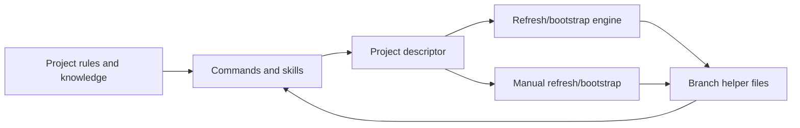

# OpenCode Conductor

OpenCode Conductor is a descriptor-driven toolkit for durable coding-session context. It combines:

- branch-local helper documents for goals, progress, phase plans, and review;
- commands for initialization, refresh, branch lifecycle, review, and verification;
- on-demand skills for engineering workflows and artifact creation;
- optional generic rules that projects can adopt selectively;
- a Bun engine for deterministic refresh and bootstrap operations, parked in `tools-off/`;
- manual refresh and bootstrap paths for hosts where custom tools are disabled.

The project is intentionally project-, framework-, service-, and model-neutral. Project-specific conventions belong in the project's own rules and knowledge files.

For a junior-friendly, in-depth explanation of installation, workflows, commands, skills, rules, extension through forks, and current limitations, read the [`OpenCode Conductor User Guide`](documentation/USER_GUIDE.md).

## Install

```bash
git clone <repository-url>
cd opencode-conductor
bash bin/install-opencode-conductor.sh
```

The installer safely seeds or merges `$OPENCODE_HOME/opencode.json` and synchronizes:

- `commands/`
- `skills/`
- `rules/`
- `project-rules/`
- `templates/`
- `tools-off/`
- runtime dependency manifests

`OPENCODE_HOME` defaults to `~/.config/opencode`.

Useful options:

```bash
# Preview all changes.
bash bin/install-opencode-conductor.sh --dry-run

# Seed a generic AGENTS.md in an existing project directory.
bash bin/install-opencode-conductor.sh --seed-agents /path/to/project

# Do not offer the interactive project-guidance prompt.
bash bin/install-opencode-conductor.sh --no-seed-agents

# Install the central Python and Node dependencies used by artifact skills.
# The installer selects an available Python >= 3.10 and requires Node >= 20.17.
bash bin/install-opencode-conductor.sh --with-runtime-deps

# Add optional PDF conversion dependencies as well.
bash bin/install-opencode-conductor.sh --with-runtime-deps --with-pdf-engines

# Also install supported system tools where automatic installation is available.
bash bin/install-opencode-conductor.sh --with-runtime-deps --with-system-deps
```

The installer never overwrites an existing project `AGENTS.md`. Existing configuration, provider settings, and local values in `opencode.json` are preserved.

## Start a project

1. Run `/project-init <projectKey>` or copy [`descriptors/descriptor.template.json`](descriptors/descriptor.template.json) to `$OPENCODE_HOME/projects/<projectKey>/descriptor.json`.
2. Adjust project roots, areas, package detection, review filters, and helper definitions.
3. Copy the MR templates to the descriptor's `branchHandoff.templatesDir` if initialization did not create them.
4. Run `/project-refresh <projectKey>` or `/manual-refresh <projectKey>`.
5. Use `/project-helper <projectKey>` to opt a branch into additional helper documents.

The current descriptor schema is v3. The engine continues to read v1 and v2 descriptors through a compatibility adapter. See [upgrading](documentation/UPGRADING.md) before migrating an established installation.

## Architecture



| Layer | Location | Purpose |
| --- | --- | --- |
| Global configuration | `$OPENCODE_HOME/opencode.json` | Command, skill, instruction, and permission registry |
| Project control plane | `$OPENCODE_HOME/projects/<key>/descriptor.json` | Roots, areas, helper registry, filters, and heuristics |
| Branch context | Descriptor-resolved directory | Selected helper files plus `HELPERS.json` |
| Project guidance | Project `AGENTS.md`, area `AGENTS.md`, leaf `KNOWLEDGE.md` | Durable conventions and orientation |
| Tool sources | `$OPENCODE_HOME/tools-off/` | Explicitly loaded Bun wrappers and shared engine |

### Why `tools-off/`

Some hosts automatically expose every module placed in `tools/`. Keeping the wrappers and shared engine in `tools-off/` makes activation explicit, avoids accidental registration of internal modules, and gives manual mode a stable default. The installer archives only known obsolete Conductor files from legacy tool locations.

## Descriptor v3

Schema v3 replaces the fixed set of branch files with an extensible helper registry:

```json
{
  "projectKey": "example",
  "descriptorSchemaVersion": 3,
  "projectRootPath": "~/projects/example",
  "opencodeProjectRootPath": "~/.config/opencode/projects/example",
  "projectAgentsPath": "~/projects/example/AGENTS.md",
  "reviewIgnoredPathGlobs": ["**/generated/**", "**/*.snap"],
  "branchSyncStaleAfterMinutes": 60,
  "branchHandoff": {
    "contextDirTemplate": "~/.config/opencode/projects/{projectKey}/branches/{branchName}",
    "templatesDir": "~/.config/opencode/projects/{projectKey}/_templates/mr",
    "helperManifestFilename": "HELPERS.json",
    "helpers": {
      "log": {
        "filename": "LOG.md",
        "templateFilename": "LOG.md",
        "role": "log",
        "bootstrap": "ask",
        "description": "Progress log for checkpoints and session handoffs."
      },
      "review": {
        "filename": "REVIEW.md",
        "role": "review",
        "bootstrap": "never",
        "description": "Review findings, triage, and verification notes."
      }
    }
  }
}
```

Each branch's `HELPERS.json` records which supported helpers that branch uses. Refresh reconciles descriptor support, manifest intent, and filesystem reality without silently recreating or deleting files. Invalid manifests are reported and preserved.

See the full [descriptor reference](documentation/DESCRIPTOR_REFERENCE.md) and [path contract](documentation/PATH_CONTRACT.md).

## Core workflows

| Need | Command |
| --- | --- |
| Initialize a project | `/project-init <projectKey>` |
| Inspect current project and Git state | `/project-state [<projectKey>]` |
| Refresh context with the Bun engine | `/project-refresh <projectKey>` |
| Refresh without custom tools | `/manual-refresh <projectKey>` |
| Bootstrap without custom tools | `/project-bootstrap <projectKey>` manual fallback |
| Fetch/pull safely, then refresh | `/project-pull-refresh <projectKey>` |
| Create or reconcile branch helpers | `/project-helper <projectKey>` |
| Bootstrap tracked branch context | `/project-bootstrap <projectKey>` |
| Create a feature branch | `/project-branch-new [<branch>]` |
| Kick off a larger branch | `/project-branch-kickoff [<projectKey>]` |
| Build a manual exploration guide | `/project-branch-explore [<branch>]` |
| Draft or refine a phase plan | `/project-phases <projectKey>` |
| Record a checkpoint | `/project-checkpoint <projectKey>` |
| Close a session | `/project-close <projectKey>` |
| Generate or continue a review | `/project-review <projectKey>` |
| Preserve-sync review and change-request state | `/project-review-sync <projectKey>` |
| Update change-request narrative | `/project-update-mr <projectKey>` |
| Scaffold or refresh knowledge | `/scaffold-knowledge`, `/project-knowledge-refresh` |
| Find stale branch contexts | `/project-cleanup-candidates <projectKey>` |
| Generate end-user help documentation | `/project-help-docs [<output-root>]` |

Focused implementation and verification helpers include `/check-types`, `/run-tests`, `/lint-fix`, `/organize-imports`, `/run-playwright-tests`, `/add-gql-mutation`, `/add-table-column`, `/extract-component`, and `/migrate-to-flex-wrapper`.

Refresh is read-only. Network-aware reconciliation is deliberately separate in `/project-pull-refresh`, which asks before network or working-tree changes.

## Skills

Skills are loaded on demand rather than included in every prompt.

Engineering and lifecycle skills:

- `git-safety`, `branch-kickoff`, `branch-explore`, `session-lifecycle`
- `discover-knowledge`, `onboard-area`, `plan-phases`, `review-branch`
- `verify-changes`, `systematic-debugging`, `refactor-safely`, `write-tests`
- `add-feature-module`, `debug-gql-query`, `playwright-e2e`
- `help-docs-author`

Artifact skills:

- `canvas-design`, `convert-to-pdf`
- `docx`, `pdf`, `pptx`, `xlsx`
- `slack-gif-creator`

Artifact skills share the optional runtime installed by `--with-runtime-deps`. Dependency manifests live in [`runtime/`](runtime/).

## Rules and project guidance

The installer ships these optional rule modules:

| Rule | Scope |
| --- | --- |
| [`CORE.md`](rules/CORE.md) | Minimal safety and collaboration baseline |
| [`CODE_QUALITY.md`](rules/CODE_QUALITY.md) | General implementation and testing quality |
| [`FRONTEND.md`](rules/FRONTEND.md) | Framework-neutral frontend practices |
| [`HANDOFF_GENERIC.md`](rules/HANDOFF_GENERIC.md) | Branch-context lifecycle contract |
| [`SENIOR_ENGINEERING.md`](rules/SENIOR_ENGINEERING.md) | Architecture and engineering decision lens |

Enable only the rules appropriate for a project through the `instructions` array in `opencode.json`. The generic project seed at [`project-rules/AGENTS.md`](project-rules/AGENTS.md) is intentionally sparse; teams should populate it with their own commands, boundaries, invariants, and verification steps.

## Model routing and cost

The shared configuration does not pin a provider or model. Keep the active session model as the default, then define local workload profiles:

- **Economy:** bounded mechanical work, such as GPT-5.6 Luna or Grok Build 0.1.
- **Balanced:** normal implementation and lifecycle work, such as GPT-5.6 Terra, Claude Sonnet 4.6, or Grok 4.5.
- **Frontier:** broad, ambiguous, or high-risk work, such as GPT-5.6 Sol or Claude Opus 4.8.
- **Frontier-plus:** unusually demanding long-horizon work, such as Claude Fable 5.

Sol, Terra, and Luna are GPT-5.6 variants; GPT-5.5 is a separate compatibility route. Claude Opus 4.7 remains useful for deployments already evaluated against it.

Read the full [model routing, context, and cost guide](documentation/MODEL_ROUTING_AND_COST.md) for current API price examples, caching and context behavior, tool-call costs, every command/skill/rule recommendation, and an evaluation plan. Detect static prompt growth with:

```bash
python3 bin/estimate-prompt-footprint.py
```

## Review and branch synchronization

Refresh partitions changed files deterministically using `reviewIgnoredPathGlobs`, reports both reviewable and ignored counts, and keeps ignored paths visible in review scope. Review findings use separate current namespaces for implementation, review, and metadata/knowledge findings while preserving older finding identifiers already present in an existing artifact.

Shared-branch status is computed from local refs. The descriptor's `branchSyncStaleAfterMinutes` controls when remote state may be stale. Refresh never fetches automatically.

## Upgrading

The migration utility is dry-run by default:

```bash
python3 bin/migrate-helper-registry.py --project-key <key>
python3 bin/migrate-helper-registry.py --project-key <key> --apply
```

It upgrades a v1/v2 descriptor to v3, discovers nested branch directories, creates helper manifests atomically, preserves legacy descriptor fields for rollback, and never deletes helper files. Review the dry-run before applying.

## Validation

Run the repository contract suite after changing commands, skills, rules, descriptors, installer behavior, or engine code:

```bash
python3 tests/contract_checks.py
```

The suite exercises fresh and merge installs, schema compatibility, helper migration, branch bootstrap/refresh behavior, review filtering and lifecycle metadata, registry consistency, neutral vocabulary, and static validation.

## Documentation

- [Canonical workflow](documentation/WORKFLOW.md)
- [Architecture and design](documentation/ARCHITECTURE.md)
- [Descriptor reference](documentation/DESCRIPTOR_REFERENCE.md)
- [Command decision matrix](documentation/COMMAND_WORKFLOW.md)
- [Path and behavior contract](documentation/PATH_CONTRACT.md)
- [Upgrade guide](documentation/UPGRADING.md)
- [Testing guide](documentation/TESTING_THE_KIT.md)
- [Extension guide](documentation/EXTENDING.md)
- [Help-document authoring](documentation/HELP_DOCS_AUTHORING.md)
- [Model routing, context, and cost guide](documentation/MODEL_ROUTING_AND_COST.md)
- [Roadmap](documentation/ROADMAP.md)
- [In-depth user and extension guide](documentation/USER_GUIDE.md)

All maintained user, contributor, and contract documentation lives in [`documentation/`](documentation/).
