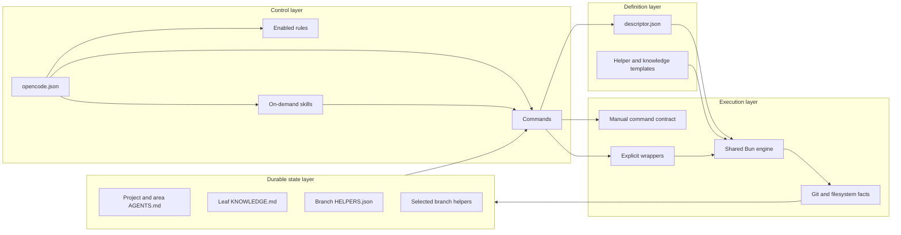
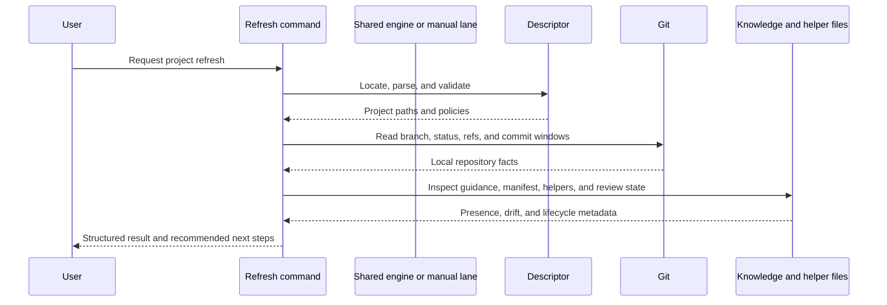
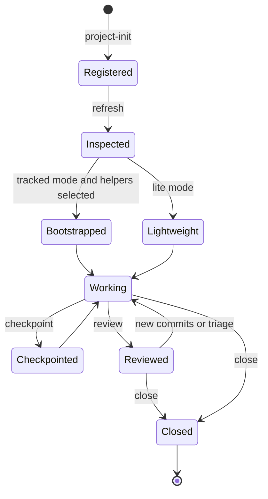
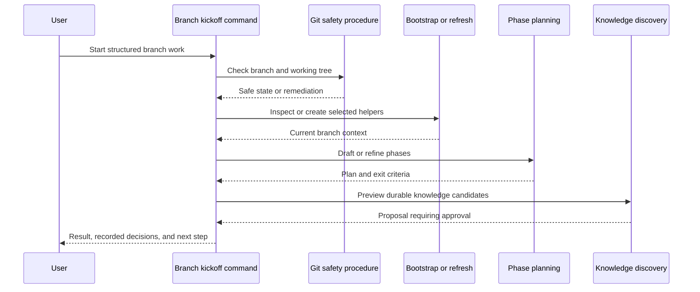
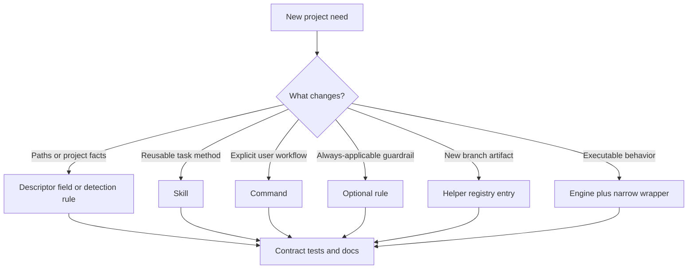
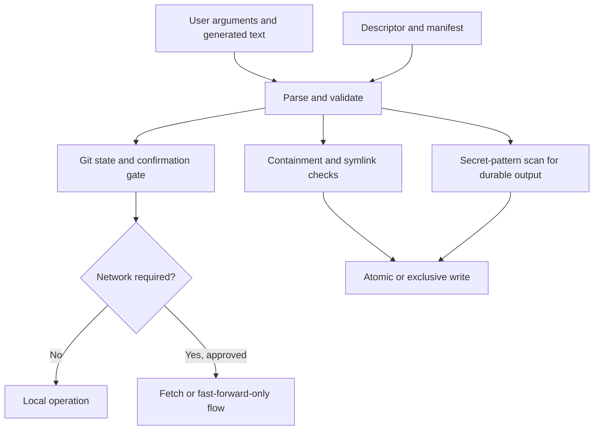
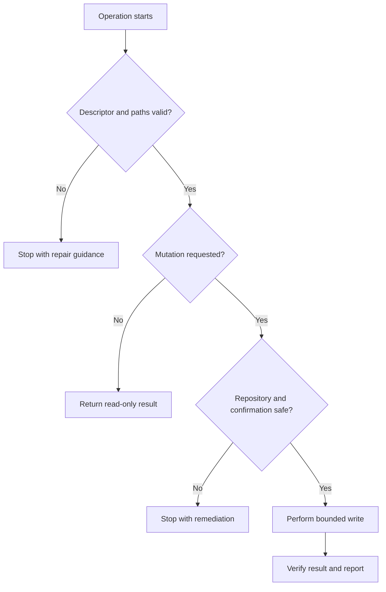

# Architecture and Design

This document explains how OpenCode Conductor is divided, how information
moves through it, and which invariants an extension must preserve. For
step-by-step usage, start with [`USER_GUIDE.md`](USER_GUIDE.md). For normative
path and write behavior, use [`PATH_CONTRACT.md`](PATH_CONTRACT.md).

## Design goals

The project is designed to:

- add repeatable engineering workflows without replacing project-owned
  conventions;
- retain useful context across sessions and branches;
- keep inspection separate from mutation;
- make Git, filesystem, and network side effects explicit;
- support small local extensions without requiring engine changes;
- preserve older descriptor schemas while new projects use schema v3;
- remain useful when executable wrappers are unavailable.

The project deliberately does not:

- choose a provider, service, model, framework, or repository layout;
- treat generated guidance as more authoritative than project documentation;
- fetch, pull, push, delete, or overwrite merely because context was refreshed;
- hide mutations behind a status command;
- require every project to use every command, skill, rule, or helper.

## Mental model

The system can be understood as four cooperating layers.

### Control layer

The control layer tells the host which assets exist and when they may be used.

- `opencode.json.template` is the installable registry.
- `commands/*.md` are explicitly invoked workflows.
- `skills/*/SKILL.md` are detailed procedures loaded only when relevant.
- `rules/*.md` are concise, optionally enabled session-wide constraints.

The installer merges missing registry entries into an existing configuration.
It does not replace project-specific provider, routing, instruction, or
permission choices.

### Definition layer

The descriptor and templates describe the project-specific shape of state.

- A descriptor identifies the source repository, integration base, areas,
  package-detection rules, ignored review paths, helper registry, and refresh
  heuristics.
- Helper templates provide initial content for branch files.
- Knowledge templates define the sparse shape of durable facts.

The descriptor is data, not executable code. The engine validates it before it
uses any descriptor-derived path.

### Durable state layer

Durable state is intentionally split by audience and lifetime.

| State | Audience | Lifetime |
| --- | --- | --- |
| Project `AGENTS.md` | Everyone working in the repository | Long-lived |
| Area `AGENTS.md` | Contributors in one source area | Long-lived |
| Leaf `KNOWLEDGE.md` | Contributors working on one source leaf | Long-lived |
| `HELPERS.json` | Engine and humans inspecting branch state | Branch-specific |
| `LOG.md` or equivalent | Session handoff readers | Branch-specific |
| `PHASES.md` or equivalent | Implementers tracking staged work | Branch-specific |
| `REVIEW.md` or equivalent | Reviewers and implementers | Branch-specific |
| Change-request helper | Authors and reviewers | Branch-specific |

Stable facts should move toward the long-lived knowledge layer. Temporary
progress, review findings, and branch decisions should stay in branch helpers.

### Execution layer

The execution layer has two supported lanes:

1. A manual lane described completely in command Markdown.
2. An executable lane using explicit wrappers under `tools-off/`.

Both lanes share the same conceptual refresh fields and safety boundaries.
Wrappers are thin entry points; reusable behavior belongs in
`tools-off/_opencode_engine.ts`.

## Main components

| Component | Responsibility | Must not do |
| --- | --- | --- |
| Installer | Merge configuration and synchronize assets | Replace local configuration or follow unsafe links |
| Descriptor migrator | Preview and apply v1/v2-to-v3 conversion | Delete legacy fields or helper files |
| Commands | Orchestrate user-visible workflows | Smuggle unconfirmed mutation into inspection |
| Skills | Provide focused procedures and reusable judgment | Become an always-loaded second rule system |
| Rules | Define broadly applicable guardrails | Encode organization- or framework-specific policy |
| Engine | Validate descriptors, resolve paths, inspect and reconcile state | Fetch or pull during refresh |
| Wrappers | Expose narrow engine operations explicitly | Duplicate engine logic |
| Contract suite | Protect registries, schemas, paths, safety, and vocabulary | Substitute for project-level behavioral tests |

## Refresh data flow

Refresh is the central read-only sequence.

Important consequences:

- remote-reference information may be stale because refresh does not fetch;
- a missing helper is reported rather than recreated;
- a malformed manifest is preserved and surfaced;
- ignored review paths remain visible in scope reporting;
- refresh recommendations are advice, not hidden actions.

Network-aware reconciliation belongs to `/project-pull-refresh`, which has its
own dirty-tree, divergence, confirmation, and fast-forward checks.

## Branch lifecycle

Tracked and lightweight work use the same project knowledge but different
amounts of branch state.

The lifecycle is advisory rather than a rigid state machine. For example, a
small fix may use refresh, work, verification, and close without a phase plan.
A larger change may add branch creation, kickoff, phase tracking, checkpoints,
review synchronization, and knowledge promotion.

## Large-branch kickoff sequence

Kickoff composes existing extension points instead of implementing a second
engine.

Each mutating step retains its own approval boundary. A composite workflow does
not grant blanket permission to fetch, switch branches, create files, or write
knowledge.

## Extension points

Choose the smallest extension point that solves the problem.

Prefer descriptor data over hard-coded project paths. Prefer a skill over a
command when no explicit user entry point is needed. Prefer a command over a
rule when behavior should run only on request. Add engine behavior only when
the operation benefits from deterministic parsing, path validation, or
structured computation.

See [`EXTENDING.md`](EXTENDING.md) for implementation checklists and
[`USER_GUIDE.md`](USER_GUIDE.md#24-extending-the-project-through-a-fork) for a
fork-oriented tutorial.

## Architectural invariants

Every contribution must preserve these invariants:

1. Descriptor-derived writes remain inside validated configured roots.
2. Root-containment checks reject traversal and unsafe symbolic links.
3. Refresh remains read-only and performs no network operation.
4. Git mutation is separately confirmed and refuses unsafe repository states.
5. Existing configuration values survive installer merges.
6. Existing helper files are not silently recreated, deleted, or overwritten.
7. A malformed descriptor or manifest is reported without destructive repair.
8. Durable knowledge writes are proposal-first and source-backed.
9. Audit blocks contain structured metadata rather than copied user prose.
10. The manual lane and executable lane expose the same core concepts.
11. New projects use schema v3 while supported older schemas remain readable.
12. Project-specific conventions stay in project guidance or overlays.

## Security and trust boundaries

The main trust boundaries are user input, descriptor paths, generated content,
Git state, network state, and executable activation.

Executable tools are stored under `tools-off/` so filesystem scanning alone
does not imply activation. The host installation must opt in to wrappers. A
manual command remains available when executable activation is unavailable or
undesirable.

For exact security rules, see [`SECURITY.md`](../SECURITY.md) and the
[security section of the path contract](PATH_CONTRACT.md#security-rules).

## Trade-offs

| Decision | Benefit | Cost |
| --- | --- | --- |
| Descriptor-driven paths | Supports varied repositories without engine forks | Descriptor quality directly affects recommendations |
| Explicit confirmation | Prevents surprising mutations | Adds interaction to branch and network workflows |
| Separate manual and executable lanes | Works across more hosts | Two representations can drift |
| Additive configuration merge | Preserves user ownership | Obsolete local entries are not automatically removed |
| Branch-specific helper selection | Avoids unnecessary files | Adds a manifest and reconciliation states |
| Central optional artifact runtime | Avoids per-skill environments | Runtime installation is larger and system support varies |
| Compatibility adapter | Reduces upgrade pressure | Keeps legacy behavior in the engine and tests |
| Markdown command contracts | Easy to inspect and extend | Some guarantees still depend on agent compliance |

These costs are intentional but should be revisited as the project gains a
supported CLI, generated schemas, reproducible runtime locks, and stronger
concurrency control.

## Failure modes

| Failure | Expected behavior | Recovery |
| --- | --- | --- |
| Dirty tree before branch mutation | Refuse the mutation | Commit, explicitly stash, or abandon the operation |
| Detached head | Report that branch context cannot be resolved normally | Check out a named branch |
| Missing descriptor | Stop project-aware processing | Run `/project-init` or pass the correct key |
| Invalid descriptor | Report the field and preserve the file | Correct it using the descriptor reference |
| Missing helper | Report drift; do not recreate | Use `/project-helper` and choose an action |
| Malformed `HELPERS.json` | Preserve and report `manifest_error` | Repair the JSON explicitly |
| Stale remote facts | Mark synchronization state uncertain | Use `/project-pull-refresh` if fresh remote facts are needed |
| Diverged branch | Refuse fast-forward reconciliation | Resolve the divergence manually |
| Unsafe path or symlink | Refuse the read/write target | Correct descriptor paths or filesystem layout |
| Secret-pattern match | Refuse durable output | Remove or redact the sensitive value |
| Wrapper unavailable | Report the unavailable executable lane | Use the documented manual fallback |
| Concurrent writers | Last atomic replacement may still win | Serialize operations; future locking is recommended |

## Related documentation

- [`USER_GUIDE.md`](USER_GUIDE.md) — junior-friendly usage and extension guide.
- [`DESCRIPTOR_REFERENCE.md`](DESCRIPTOR_REFERENCE.md) — descriptor fields and
  examples.
- [`WORKFLOW.md`](WORKFLOW.md) — canonical workflow contract.
- [`WORKFLOW_MAPS.md`](WORKFLOW_MAPS.md) — focused branch workflow diagrams.
- [`PATH_CONTRACT.md`](PATH_CONTRACT.md) — normative path, knowledge, review,
  and write behavior.
- [`EXTENDING.md`](EXTENDING.md) — contribution contracts.
- [`TESTING_THE_KIT.md`](TESTING_THE_KIT.md) — validation procedures.
