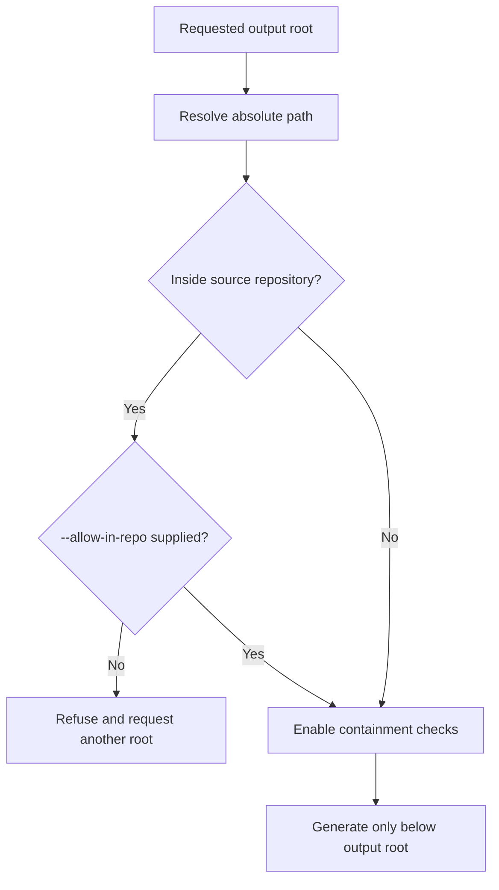
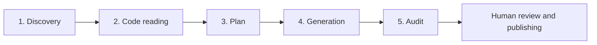
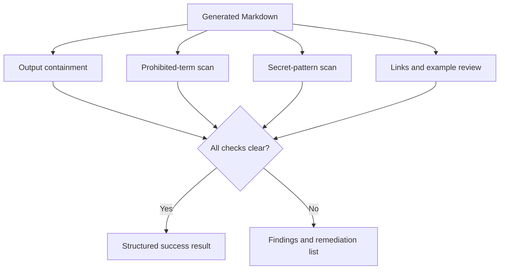
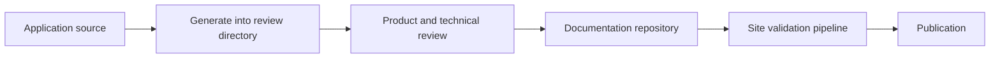

# Help-Document Authoring

`/project-help-docs` and the `help-docs-author` skill generate end-user
documentation from source evidence. They are intended for product guides,
operator runbooks, support articles, and help-center pages rather than internal
implementation notes.

This workflow generates Markdown. It does not deploy a documentation site.

## When to use it

Use the workflow when:

- user-visible behavior is implemented but not documented;
- an existing help center needs to be refreshed from changed code;
- one feature needs separate instructions for different audiences;
- terminology must be normalized before publishing;
- generated pages must be checked for prohibited wording or secrets.

Do not use it as a substitute for:

- API reference generation from a formal schema;
- internal architecture documentation;
- release notes derived only from commit messages;
- legal, compliance, or policy approval;
- publishing without human review.

## Command shape

```text
/project-help-docs <output-root> [options]
```

If `<output-root>` is omitted, the command asks for it. Prefer an absolute path
to a dedicated documentation repository or a temporary review directory.

### Options

| Option | Purpose |
| --- | --- |
| `--scope=<path-or-area>` | Repeatable source scope; limits discovery |
| `--audience=<label>` | Audience metadata, defaulting to end users |
| `--brand=<from:to>` | Repeatable terminology replacement |
| `--ban-term=<term>` | Repeatable prohibited term added to the audit |
| `--no-frontmatter` | Omits portable YAML page metadata |
| `--no-mermaid` | Omits Mermaid diagrams |
| `--no-vocab-grep` | Disables the post-generation prohibited-term check |
| `--allow-in-repo` | Explicitly permits output inside the source repository |

Unknown arguments trigger clarification instead of being ignored.

## Safety-first output choice

By default, output inside the source repository is refused. This avoids
accidentally mixing user-facing pages into application source.



`--allow-in-repo` changes only the repository-location check. It does not
disable path containment, secret checks, source-evidence requirements, or
human review.

## Five-phase workflow



### Phase 1: Discovery

The workflow first identifies what could be documented.

Inputs:

- requested source scopes;
- target audiences;
- product or terminology replacements;
- existing user documentation, when available;
- user-visible entry points in the source tree.

Discovery should inspect stable entry points before low-level helpers:

- routes and screens;
- command entry points;
- public handlers and request schemas;
- configuration surfaces;
- permissions and feature gates;
- orchestration code;
- user-visible error definitions;
- existing examples and tests.

Output:

- a feature inventory;
- the audience set;
- relevant source paths;
- known prerequisites and uncertainty.

Discovery is not generation. Finding a file or function name does not prove a
user-visible capability.

### Phase 2: Code reading

For each candidate feature, read enough connected source to establish:

- what starts the flow;
- required inputs and prerequisites;
- defaults;
- success behavior;
- alternative paths;
- permissions and visibility;
- error states;
- side effects;
- recovery actions;
- limitations a user can observe.

Claims should be traceable to source evidence. Tests may confirm edge cases but
should not be the sole source when production behavior differs.

Avoid copying implementation vocabulary into user documentation when a stable
product term exists.

Output:

- a per-feature behavior summary;
- evidence paths for important claims;
- unresolved questions that need user or maintainer input.

### Phase 3: Plan

The workflow proposes page outlines before writing.

Each outline should identify:

- page title;
- audience;
- user goal;
- prerequisites;
- ordered procedure;
- expected result;
- troubleshooting or recovery;
- related pages;
- source evidence.

This is the best point to change scope or terminology. Correcting an outline is
cheaper than rewriting several generated pages.

No page should be planned merely to mirror a source directory. Organize around
user goals.

### Phase 4: Generation

Pages are written only beneath the approved output root.

Default page features:

- portable YAML frontmatter;
- procedural, user-facing language;
- source-backed examples;
- Mermaid only when a relationship or sequence is easier to understand
  visually;
- links between prerequisites, tasks, and troubleshooting pages.

A portable frontmatter example:

```yaml
---
title: Invite a team member
audience:
  - administrator
feature: team-membership
---
```

The exact fields may be adapted for the destination site. Disabling
frontmatter with `--no-frontmatter` affects metadata only; it does not weaken
content audits.

### Phase 5: Audit

The final generated tree is checked before it is handed off.



The audit covers:

- resolved output paths;
- prohibited vocabulary unless explicitly disabled;
- secret-like content;
- internal or broken links that can be validated locally;
- examples that contradict discovered behavior;
- unsupported claims found during review.

`--no-vocab-grep` disables only the prohibited-term check. It does not disable
the secret scan.

## Terminology replacement and prohibited terms

Terminology replacement and prohibited terms solve different problems.

- `--brand=<from:to>` says how a term should be rendered.
- `--ban-term=<term>` says the term must not remain in output.

For a renaming, use both:

```text
--brand=OldLabel:NewLabel --ban-term=OldLabel
```

The replacement normalizes generated prose. The prohibited-term scan catches
missed occurrences in examples, diagrams, metadata, or source-derived text.

The maintained project provides no organization-specific default ban list.
Local installations or forks may define their own vocabulary policy.

## Output containment

Before every write, the candidate path must:

1. resolve successfully;
2. be a strict descendant of the approved output root;
3. avoid traversal through `..`;
4. avoid a symbolic-link escape;
5. satisfy the in-repository policy;
6. pass the pre-write content checks.

A path such as this is refused:

```text
<output-root>/guides/../../source/README.md
```

Containment applies to initial creation and later overwrite. Approval for one
output root does not grant access to neighboring directories.

## Secret scanning

Generated pages are checked for common secret shapes before final output,
including:

- access-key patterns;
- token-shaped values;
- private-key markers;
- long credential-like strings near words such as `token`, `secret`, or
  `api_key`.

When a match is found, the workflow should report enough redacted location
information to fix the source without reproducing the sensitive value.

Secret scanning reduces accidental disclosure but cannot prove that content is
non-sensitive. Human review remains required.

## Mermaid guidance

Use diagrams for:

- a user journey with several decisions;
- permission or role inheritance;
- multi-system data movement;
- lifecycle state changes;
- recovery paths that branch.

Avoid diagrams for:

- one short linear procedure;
- decorative summaries;
- content already clearer as a table;
- implementation internals irrelevant to the reader.

`--no-mermaid` suppresses diagrams across the generation run.

## Structured result

The command returns a stable summary:

```markdown
## Help docs generation result
- output_root: <path>
- scopes: <list>
- files_written: <count>
- files: <paths>
- frontmatter: <enabled|disabled>
- mermaid: <enabled|disabled>
- vocab_grep: <enabled|disabled>
- findings: <none|summary>
- next_step: <review or publishing instruction>
```

Treat `findings: none` as “the automated checks passed,” not “the
documentation is approved for publication.”

## Worked example

Generate administrator help for an onboarding area:

```text
/project-help-docs /tmp/product-help \
  --scope=src/onboarding \
  --audience=administrator \
  --brand=OldLabel:NewLabel \
  --ban-term=OldLabel
```

Expected process:

1. Confirm `/tmp/product-help` as the output root.
2. Discover user-visible onboarding flows.
3. Read connected source and tests.
4. Present page outlines.
5. Generate approved pages.
6. Audit paths, terminology, secrets, links, and examples.
7. Return the structured result.
8. Have a subject-matter owner review the pages.
9. Copy or commit the reviewed pages into the publishing workflow.

## Publishing

The command does not publish or deploy.

A typical handoff is:



Keep publication credentials and site deployment outside the authoring skill.
This separation allows the same generated Markdown to work with different
documentation platforms.

## Troubleshooting

| Problem | Likely cause | Resolution |
| --- | --- | --- |
| Output root refused | Path is inside source or cannot be safely resolved | Choose an external directory or explicitly use `--allow-in-repo` |
| A page was not planned | Scope did not include its entry point | Add a narrower repeated `--scope` and rerun discovery |
| Prohibited term remains | Replacement missed metadata, code example, or diagram | Correct the page or add a replacement before rerunning |
| Secret check fails | Example or source-derived content looks credential-like | Remove, redact, or replace with an obvious placeholder |
| Pages describe internals | Discovery followed directory structure instead of user goals | Re-plan around tasks and observable behavior |
| Frontmatter is incompatible | Destination requires different fields | Adjust during planning, disable it, or extend the skill locally |
| Diagram adds little value | Flow is too simple | Remove it or rerun with `--no-mermaid` |
| Links point into source | Source evidence leaked into reader-facing navigation | Keep evidence in the plan or review notes, not public links |

## Maintainer extension points

To adapt the workflow:

- extend argument parsing in `commands/project-help-docs.md`;
- update the phase contract in `skills/help-docs-author/SKILL.md`;
- keep command flags, skill inputs, this guide, and tests synchronized;
- prefer destination-neutral YAML fields in the shared project;
- add framework-specific metadata or publishing steps in a local overlay;
- retain containment and secret checks even when customizing output.

Run the complete contract suite after changing the command or skill:

```bash
python3 tests/contract_checks.py
```

## Related sources

- [`commands/project-help-docs.md`](../commands/project-help-docs.md) — command
  contract.
- [`skills/help-docs-author/SKILL.md`](../skills/help-docs-author/SKILL.md) —
  skill procedure.
- [`PATH_CONTRACT.md`](PATH_CONTRACT.md#output-containment) — normative output
  containment.
- [`USER_GUIDE.md`](USER_GUIDE.md#project-help-docs-output-root) — command
  overview in the full guide.
