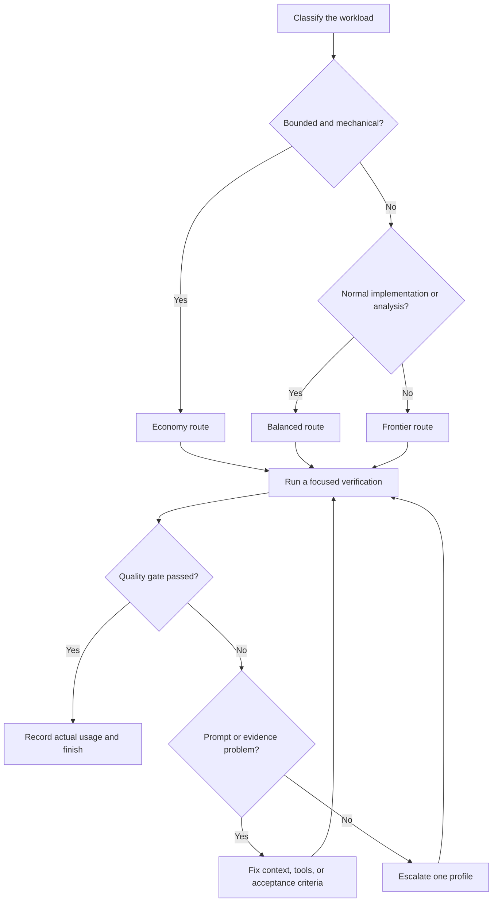

# Model routing, context, and cost guide

This guide explains how to choose models for Conductor workloads without making the shared kit depend on a provider. It covers static prompt size, API pricing, caching, tool calls, context growth, and practical routing for every bundled command, skill, and rule.

Prices and model details are a **2026-07-24 snapshot** of public standard API rates in US dollars. They are not subscription prices, host credits, negotiated enterprise rates, regional premiums, or guarantees of future pricing. Recheck the linked vendor pages before budgeting.

## The short version

1. Leave model fields unset in the shared kit. The active session model remains the neutral default.
2. Define `economy`, `balanced`, and `frontier` routes in local deployment configuration.
3. Start bounded, mechanical work on an economy route.
4. Use a balanced route for normal implementation, investigation, documentation, and branch lifecycle work.
5. Escalate to a frontier route for high-risk review, cross-system architecture, ambiguous debugging, or long-horizon work.
6. Keep stable instructions and tool definitions at the start of a request so the provider can reuse a cached prefix.
7. Measure actual input, cached input, reasoning, tool, retry, and output usage. Static prompt size alone is not a bill.

> **Naming correction:** Sol, Terra, and Luna are GPT-5.6 variants. GPT-5.5 is a separate model. Routes such as “GPT-5.5 Terra” are not valid model names.

## Provider-neutral routing profiles

| Profile | Good default for | Example models | Escalate when |
| --- | --- | --- | --- |
| Economy | Formatting, deterministic checks, bounded edits, refresh/state reporting | GPT-5.6 Luna; Grok Build 0.1 | The task becomes ambiguous, spans components, or fails twice |
| Balanced | Normal coding, investigation, lifecycle commands, docs, test design | GPT-5.6 Terra; Claude Sonnet 4.6; Grok 4.5 | Risk is high, requirements conflict, or evidence remains inconclusive |
| Frontier | Architecture, migrations, difficult debugging, security-sensitive review, broad synthesis | GPT-5.6 Sol; Claude Opus 4.8 | The work is unusually long-horizon or still fails an evaluation |
| Frontier-plus | Multiday autonomy, unusually complex review, highly ambiguous cross-system work | Claude Fable 5 | A refusal, retention constraint, or cost ceiling requires fallback |

Claude Opus 4.7 is a compatibility route where an existing evaluation is already tuned for it. GPT-5.5 is also a migration route: its public token rates match GPT-5.6 Sol, so a new deployment should evaluate Sol before retaining GPT-5.5 as the default.



Routing is a quality-and-cost control loop, not a permanent ranking. A low-cost model that needs three retries can cost more than a stronger model that succeeds once.

### Reasoning and effort

Use the lowest effort that reliably passes the task's quality gate:

| Workload | Starting effort | Increase effort when |
| --- | --- | --- |
| Deterministic reporting or formatting | None/low where supported | The model omits required fields or mishandles edge cases |
| Normal coding and investigation | Medium | Evidence conflicts or the first verified attempt fails |
| Architecture, review, difficult debugging | High | The task is long-running and still benefits from deeper search |
| Exceptional long-horizon work | `xhigh`/maximum only after evaluation | A fixed high setting has demonstrated better accepted-task cost |

GPT-5.6 supports a family of reasoning-effort controls; map economy work to none/low, balanced work to medium, and frontier work to high before considering `xhigh` or maximum. Claude Fable 5 uses adaptive thinking only, while current Opus and Sonnet models expose effort controls. Grok 4.5 exposes low, medium, and high. Provider semantics differ, so “medium” is not comparable across vendors.

Higher effort can improve hard tasks, but it can also increase output-side reasoning charges and latency. Never compensate for missing evidence, unclear acceptance criteria, or an oversized tool set by increasing effort first.

## Current price and context snapshot

Standard API prices per one million tokens:

| Model | Example API ID | Profile | Context | Input | Cache read | Output |
| --- | --- | --- | ---: | ---: | ---: | ---: |
| Claude Fable 5 | `claude-fable-5` | Frontier-plus | 1M | $10.00 | $1.00 | $50.00 |
| Claude Opus 4.8 | `claude-opus-4-8` | Frontier | 1M | $5.00 | $0.50 | $25.00 |
| Claude Opus 4.7 | `claude-opus-4-7` | Frontier compatibility | 1M | $5.00 | $0.50 | $25.00 |
| Claude Sonnet 4.6 | `claude-sonnet-4-6` | Balanced | 1M | $3.00 | $0.30 | $15.00 |
| GPT-5.6 Sol | `gpt-5.6-sol` | Frontier | 1.05M | $5.00 | $0.50 | $30.00 |
| GPT-5.6 Terra | `gpt-5.6-terra` | Balanced | 1.05M | $2.50 | $0.25 | $15.00 |
| GPT-5.6 Luna | `gpt-5.6-luna` | Economy | 1.05M | $1.00 | $0.10 | $6.00 |
| GPT-5.5 | `gpt-5.5` | Frontier compatibility | 1.05M | $5.00 | $0.50 | $30.00 |
| Grok 4.5 | `grok-4.5` | Balanced | 500K | $2.00 | $0.30 | $6.00 |
| Grok Build 0.1 | `grok-build-0.1` | Economy | 256K | $1.00 | $0.20 | $2.00 |

Provider-specific caveats:

- Claude 5-minute cache writes cost 1.25 times ordinary input and 1-hour writes cost 2 times ordinary input. Cache reads cost 0.1 times ordinary input. A 5-minute entry pays for its write premium after one read; a 1-hour entry after two reads.
- Claude Opus 4.8 standard mode is shown in the table; fast mode uses the same model at $10 input and $50 output. Opus 4.7 fast mode is retired, although the standard model remains available.
- Claude Fable 5, Opus 4.8, and Opus 4.7 use a newer tokenizer. Anthropic reports roughly 30% more tokens for the same text on average, with workload-dependent variation. Do not compare them using byte size alone.
- Claude Fable 5 can return a successful HTTP response with a refusal stop reason. Integrations need explicit refusal handling and an evaluated fallback, commonly Opus 4.8. Fable also has model-specific retention requirements.
- OpenAI prices in the table apply below the long-context threshold. Requests above 272K input tokens are billed at 2 times input and 1.5 times output for the whole request.
- Grok 4.5 and Grok Build rates double for requests at or above 200K input tokens.
- Batch APIs can reduce token prices for non-interactive work, but add latency and should be evaluated against workflow needs.
- Tool schemas, tool-call blocks, tool results, images, and server-side tool fees can add costs not represented by static Markdown.

Official references:

- [OpenAI model selection and GPT-5.6 guidance](https://developers.openai.com/api/docs/guides/latest-model)
- [OpenAI API pricing](https://openai.com/api/pricing/)
- [GPT-5.5 model reference](https://developers.openai.com/api/docs/models/gpt-5.5)
- [Anthropic API pricing](https://platform.claude.com/docs/en/about-claude/pricing)
- [Claude Fable 5 integration guide](https://platform.claude.com/docs/en/about-claude/models/introducing-claude-fable-5-and-claude-mythos-5)
- [Claude model release notes](https://platform.claude.com/docs/en/release-notes/overview)
- [Claude Opus fast mode](https://platform.claude.com/docs/en/build-with-claude/fast-mode)
- [Grok 4.5 model reference](https://docs.x.ai/developers/grok-4-5)
- [xAI API pricing](https://docs.x.ai/developers/pricing)
- [Grok Build 0.1 release](https://x.ai/news/grok-build-0.1)

## Worked cost examples

Use this general formula:

```text
request cost =
  uncached_input_tokens / 1,000,000 × uncached_input_rate
  + cached_input_tokens / 1,000,000 × cache_read_rate
  + output_tokens / 1,000,000 × output_rate
  + cache_write_premium
  + provider tool fees
```

The following example uses 12K uncached input, 48K cache-read input, and 4K output. It excludes cache-write premiums, tools, regional pricing, retries, and long-context multipliers.

| Model | With the 48K cache hit | If all 60K input is uncached | Savings from this cache hit |
| --- | ---: | ---: | ---: |
| Claude Fable 5 | $0.3680 | $0.8000 | $0.4320 |
| Claude Opus 4.8 | $0.1840 | $0.4000 | $0.2160 |
| Claude Opus 4.7 | $0.1840 | $0.4000 | $0.2160 |
| Claude Sonnet 4.6 | $0.1104 | $0.2400 | $0.1296 |
| GPT-5.6 Sol | $0.2040 | $0.4200 | $0.2160 |
| GPT-5.6 Terra | $0.1020 | $0.2100 | $0.1080 |
| GPT-5.6 Luna | $0.0408 | $0.0840 | $0.0432 |
| GPT-5.5 | $0.2040 | $0.4200 | $0.2160 |
| Grok 4.5 | $0.0624 | $0.1440 | $0.0816 |
| Grok Build 0.1 | $0.0296 | $0.0680 | $0.0384 |

This comparison demonstrates why cache shape matters. It does **not** predict total command cost: repository context, reasoning, tool results, output length, retries, and quality determine the real total.

## Static Conductor footprint

Run:

```bash
python3 bin/estimate-prompt-footprint.py
python3 bin/estimate-prompt-footprint.py --format json
```

The estimator uses `ceil(UTF-8 bytes / 4)`. This deliberately simple proxy works across providers for change detection, but not billing. Actual tokenizers differ, and the host may inject additional rules and tool schemas.

At this snapshot:

| Component | Files | Combined proxy tokens | When charged |
| --- | ---: | ---: | --- |
| Commands | 29 | ~39,617 | Only the invoked command template |
| Skills | 23 | ~39,905 | Only loaded skills |
| All rules | 5 | ~4,503 | Only enabled rules |
| Default rule stack | 4 | ~3,760 | Usually every request |

The combined command and skill totals are inventory sizes, not a single prompt. Commands and skills are designed for selective loading.

The default 3,760-token rule stack has this approximate uncached input cost per request:

| Model | Uncached rule input | Cache-read rule input |
| --- | ---: | ---: |
| Claude Fable 5 | $0.03760 | $0.003760 |
| Claude Opus 4.8 / 4.7 | $0.01880 | $0.001880 |
| Claude Sonnet 4.6 | $0.01128 | $0.001128 |
| GPT-5.6 Sol / GPT-5.5 | $0.01880 | $0.001880 |
| GPT-5.6 Terra | $0.00940 | $0.000940 |
| GPT-5.6 Luna | $0.00376 | $0.000376 |
| Grok 4.5 | $0.00752 | $0.001128 |
| Grok Build 0.1 | $0.00376 | $0.000752 |

These figures exclude cache-write cost and assume the rule text is the only input. They are most useful for understanding why a stable cached rule prefix is valuable.

## Command routing matrix

“Static tokens” is the byte-based proxy for the command template only. The recommended profile assumes ordinary risk; use the escalation column when the task changes shape.

| Command | Static tokens | Profile | Escalate when |
| --- | ---: | --- | --- |
| `add-gql-mutation` | 382 | Economy | Schema conventions are unclear or security-sensitive inputs are involved |
| `add-table-column` | 239 | Economy | Rendering, permissions, or computed values cross component boundaries |
| `check-types` | 355 | Economy | Failures require architectural diagnosis rather than reporting |
| `extract-component` | 225 | Economy | State, lifecycle, accessibility, or performance boundaries change |
| `lint-fix` | 407 | Economy | Auto-fixes are broad, semantic, or conflicting |
| `manual-refresh` | 3,084 | Economy | Descriptor resolution is ambiguous or state is inconsistent |
| `migrate-to-flex-wrapper` | 864 | Economy | Layout semantics or responsive behavior are uncertain |
| `organize-imports` | 380 | Economy | Imports have side effects or generated boundaries |
| `project-bootstrap` | 2,046 | Economy | Existing files conflict or safe recovery is unclear |
| `project-branch-explore` | 553 | Balanced | The branch crosses systems or requires architectural synthesis |
| `project-branch-kickoff` | 2,835 | Balanced | Migration, security, broad ambiguity, or many workstreams are present |
| `project-branch-new` | 1,723 | Balanced | Dirty state, divergence, submodules, or protected refs complicate Git safety |
| `project-checkpoint` | 1,788 | Economy | The checkpoint requires complex synthesis across agents or systems |
| `project-cleanup-candidates` | 501 | Economy | Any deletion decision is requested; this command should only report |
| `project-close` | 656 | Economy | Unresolved risks require a broader handoff analysis |
| `project-help-docs` | 505 | Balanced | Behavior must be inferred across many areas or user roles |
| `project-helper` | 1,320 | Economy | Existing manifest and filesystem state conflict |
| `project-init` | 1,724 | Balanced | Multiple roots, unusual storage, or migration compatibility is involved |
| `project-knowledge-refresh` | 1,780 | Balanced | Evidence conflicts or proposed guidance affects many teams |
| `project-phases` | 1,042 | Balanced | The plan spans systems, migrations, or uncertain dependencies |
| `project-pull-refresh` | 1,013 | Balanced | Divergence, conflicts, or working-tree preservation is non-trivial |
| `project-refresh` | 1,743 | Economy | Derived paths or manifest state are inconsistent |
| `project-review-sync` | 1,927 | Balanced | Review state conflicts with implementation evidence |
| `project-review` | 5,454 | Frontier | Use balanced only for a small, low-risk, well-tested diff |
| `project-state` | 750 | Economy | State needs diagnosis instead of a factual summary |
| `project-update-mr` | 2,197 | Balanced | The narrative depends on disputed scope or incomplete verification |
| `run-playwright-tests` | 275 | Economy | Failures require browser, timing, or distributed-system diagnosis |
| `run-tests` | 369 | Economy | Failures are flaky, cross-package, or hard to localize |
| `scaffold-knowledge` | 3,491 | Balanced | The hierarchy is large or durable guidance is disputed |

## Skill routing matrix

Skills can include checklists and tools in addition to their static Markdown. Load a skill only when its trigger matches the request.

| Skill | Static tokens | Profile | Escalate when |
| --- | ---: | --- | --- |
| `add-feature-module` | 721 | Balanced | The module changes architecture or shared contracts |
| `branch-explore` | 459 | Balanced | Repository boundaries or ownership are unclear |
| `branch-kickoff` | 3,497 | Balanced | High-risk, multi-system, or long-horizon planning is required |
| `canvas-design` | 3,101 | Balanced | Visual requirements are highly ambiguous or evaluation repeatedly fails |
| `convert-to-pdf` | 2,916 | Economy | Conversion failures require document-format diagnosis |
| `debug-gql-query` | 537 | Balanced | Authorization, caching, or distributed data flow is involved |
| `discover-knowledge` | 1,552 | Balanced | Evidence conflicts across many areas |
| `docx` | 5,104 | Balanced | Complex redlines, pagination, or inaccessible source material is involved |
| `git-safety` | 1,661 | Balanced | History rewrite, recovery, or protected remote refs are involved |
| `help-docs-author` | 555 | Balanced | The audience or product behavior is uncertain |
| `onboard-area` | 717 | Balanced | The area spans several packages or conventions conflict |
| `pdf` | 3,455 | Balanced | Forms, redaction, signatures, or difficult layout repair is involved |
| `plan-phases` | 1,204 | Balanced | Dependencies are ambiguous or cross-system |
| `playwright-e2e` | 722 | Balanced | Failures are flaky, timing-sensitive, or infrastructure-dependent |
| `pptx` | 2,395 | Balanced | Narrative and visual design require broad synthesis |
| `refactor-safely` | 665 | Balanced | Public APIs, migrations, or high blast radius are involved |
| `review-branch` | 2,544 | Frontier | Use balanced only for a small and low-risk diff |
| `session-lifecycle` | 738 | Economy | Handoff material is inconsistent or incomplete |
| `slack-gif-creator` | 2,166 | Balanced | Visual timing or compression repeatedly fails |
| `systematic-debugging` | 660 | Balanced | Evidence remains inconclusive after a disciplined first pass |
| `verify-changes` | 818 | Economy | Verification needs risk analysis across systems |
| `write-tests` | 845 | Balanced | Correctness properties or boundaries are ambiguous |
| `xlsx` | 2,882 | Balanced | Formula semantics, recalculation, or financial accuracy is high-risk |

## Rule routing matrix

Rules differ from commands and skills because enabled rules are commonly sent on every call. Prefer a small stable set.

| Rule | Static tokens | Recommended use | Token-saving note |
| --- | ---: | --- | --- |
| `CORE` | 623 | All profiles | Keep enabled; it carries the minimum collaboration and safety contract |
| `CODE_QUALITY` | 1,112 | Implementation profiles | Disable for pure read-only refresh/reporting if local policy permits |
| `FRONTEND` | 743 | Frontend work only | Keep opt-in; do not enable globally for backend-only repositories |
| `HANDOFF_GENERIC` | 1,369 | Descriptor lifecycle work | Disable when a repository does not use Conductor handoffs |
| `SENIOR_ENGINEERING` | 657 | Balanced/frontier work | Mechanical tasks can omit it when equivalent safeguards remain |

Do not remove safety rules merely to reduce token count. First remove irrelevant provider schemas, duplicated project guidance, stale logs, and unnecessarily broad file/history reads.

## Caching that actually works

A provider can usually reuse only an exact or compatible prefix. Structure requests in this order:

1. stable system and safety instructions;
2. stable project rules;
3. stable tool definitions;
4. skill or command template;
5. repository evidence;
6. volatile task details and latest user message.

Avoid placing timestamps, random identifiers, changing branch summaries, or unordered tool lists near the beginning. One early byte change can invalidate the useful prefix.

For long sessions:

- keep the same model and tool set while a cache entry is valuable;
- prefer append-only conversation state to repeatedly rewriting the prefix;
- use provider conversation identifiers or cache keys when available;
- compact old tool output into a short evidence summary before it crowds out active code;
- retain file paths, commit identifiers, decisions, failures, and unresolved questions in summaries;
- start a fresh task when the current context is mostly obsolete;
- compare cache-read tokens with total input tokens, not just the reported hit rate.

Grok 4.5 documents `prompt_cache_key` for the Responses API and a conversation header for the Chat Completions API. OpenAI and Anthropic have their own cache controls and retention behavior. Implement these in provider adapters, not shared command Markdown.

## Tool calls, reasoning, and subtask boundaries

API cost is not only visible prose:

- Tool definitions are input. Exposing 100 tools to a command that uses two wastes context and can reduce selection accuracy.
- Tool results re-enter context. Limit log output, prefer targeted searches, and summarize large JSON responses.
- Some server-side tools add a separate per-call fee. Record it next to token charges.
- Reasoning usage may be billed as output or exposed in a separate field. Preserve the raw usage response in cost telemetry.
- A subtask often starts a new request. It can improve isolation, but may repay the rules, tools, and repository context if the provider cannot reuse the prefix.
- Retries multiply input and cache-write costs. Record attempt count and stop retrying an unchanged prompt.
- Parallel subtasks reduce elapsed time but can duplicate the same prefix and evidence. Use them only for genuinely independent work.

For a bounded command, prefer one focused call with a small tool set. For a large review, split by independent subsystem only when each slice has clear scope and the final synthesizer receives concise findings rather than full transcripts.

## Local routing example

The shared `opencode.json.template` intentionally contains no provider or model pins. A local deployment can maintain an equivalent mapping:

```json
{
  "profiles": {
    "economy": ["gpt-5.6-luna", "grok-build-0.1"],
    "balanced": ["gpt-5.6-terra", "claude-sonnet-4-6", "grok-4.5"],
    "frontier": ["gpt-5.6-sol", "claude-opus-4-8"],
    "frontierPlus": ["claude-fable-5"]
  },
  "policy": {
    "default": "balanced",
    "escalateAfterFailedQualityGates": 1,
    "fallbackOnUnavailableModel": true
  }
}
```

This is an illustrative policy, not a schema shipped by Conductor. Translate it into the routing mechanism supported by the local host. Pin dated model versions where reproducibility matters, and retest before changing an alias.

## Token-saving changes already applied

The kit uses these practices:

- Commands and skills are on demand rather than always-on.
- Shared configuration does not pin a model.
- Rules instruct agents to bound searches, reuse verified facts, and avoid unconditional history reads.
- The senior-engineering rule now makes history inspection conditional on intent, ownership, or regression questions.
- The branch-kickoff skill routes by workload profile without naming a mandatory provider.
- The footprint estimator makes prompt growth visible in review and CI.
- Refresh has deterministic tooling and a manual fallback, so factual state gathering does not require a frontier model.

## Recommended next optimizations

These are candidates for future releases and need evaluation before implementation:

1. Split `HANDOFF_GENERIC` into a short always-on lifecycle trigger and an on-demand detailed contract. It is the largest default rule.
2. Generate command reference metadata from `opencode.json.template` so descriptions do not drift across configuration and documentation.
3. Add a CI budget that reports, but initially does not fail on, per-file and default-rule prompt growth.
4. Create compact and full variants of `project-review`; the current template is the largest command at about 5.5K proxy tokens.
5. Move deterministic refresh/bootstrap validation into the engine and keep command Markdown focused on orchestration and output contracts.
6. Add an opt-in local telemetry sink containing model ID, profile, input, cache write/read, reasoning, output, tool fees, retry count, duration, and quality-gate result—never prompt content.
7. Evaluate an executor/advisor pattern: an economy or balanced executor handles the loop while a frontier advisor is called only for strategic decisions.
8. Add per-command output budgets and stop conditions for long-horizon models.
9. Test provider-specific compaction so summaries retain decisions and evidence without carrying raw tool logs.
10. Track “cost per accepted task,” not cost per request. Include retries and human rework.

## Evaluation plan

Before changing routing defaults, build a private, representative suite:

- 10 bounded mechanical tasks;
- 10 normal implementation or lifecycle tasks;
- 10 reviews or debugging tasks with known findings;
- at least three long-context tasks;
- at least three tasks that invoke external tools;
- failure cases for unavailable models, timeouts, malformed tool results, and refusals.

For every run record:

| Dimension | Why it matters |
| --- | --- |
| Acceptance tests passed | Cheapest is irrelevant if the change is wrong |
| Human review outcome | Captures maintainability and missed requirements |
| Attempts and fallbacks | Reveals retry multiplication |
| Uncached and cached input | Shows whether prompt structure is working |
| Reasoning and output tokens | Identifies overthinking and verbosity |
| Tool calls and tool-result bytes | Finds schema and log bloat |
| Wall-clock time | Separates price from developer latency |
| Total API cost | Enables cost-per-accepted-task comparison |

Run each model more than once because agentic outcomes vary. Keep prompt, repository revision, tools, and acceptance criteria fixed. Promote a route only when its quality stays above the required threshold and its median accepted-task cost improves.

## Known limitations

- The estimator is intentionally tokenizer-agnostic and cannot predict images, tool schemas, hidden host instructions, or reasoning.
- Vendor prices and model aliases change. The date at the top matters.
- Public API price does not include subscription plans, cloud-provider markups, regional processing, or negotiated discounts.
- Quality recommendations are workload hypotheses until validated against the local repository.
- Cache hits depend on the host/provider integration; writing stable Markdown does not guarantee that caching is enabled.
- Long context can increase cost and reduce focus even when it fits in the advertised window.
- Fable 5 refusal and retention behavior can make it unsuitable for some environments even when its capability is attractive.
- Grok Build 0.1 is a public beta; availability and behavior may change faster than a stable model.
- Per-command recommendations assume the command remains within its documented scope. A small command can still expose a high-risk decision.
