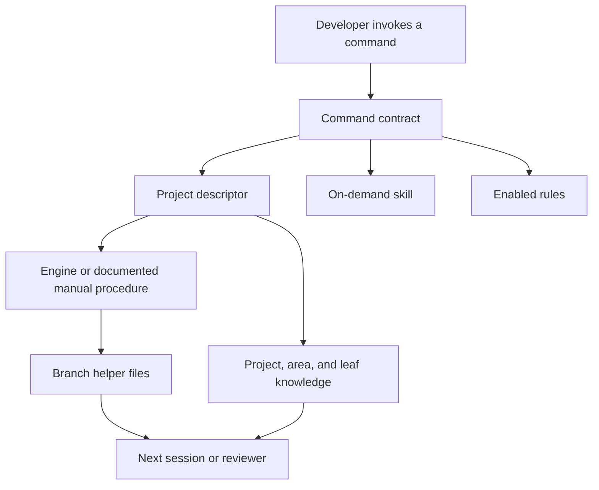
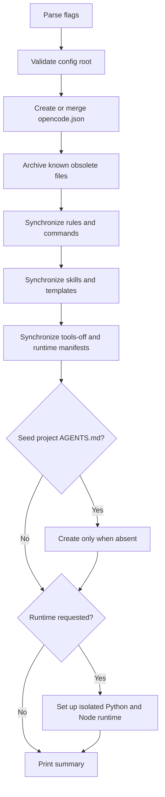
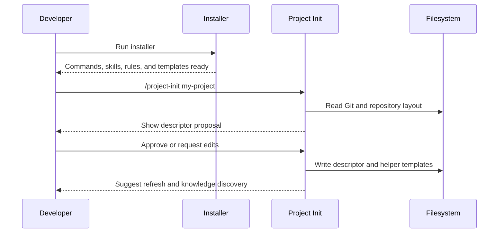
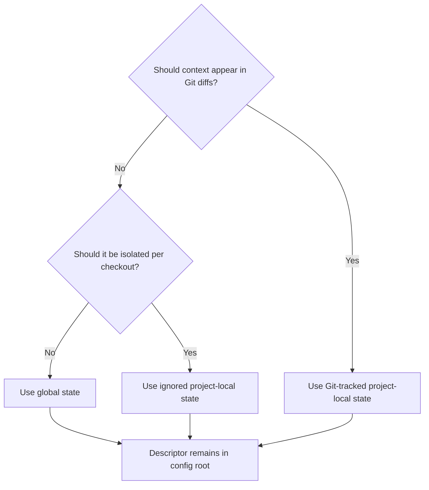
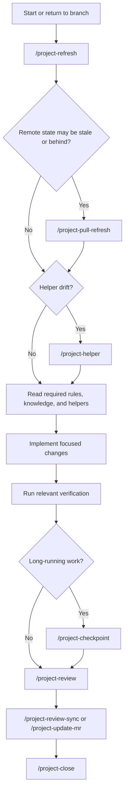
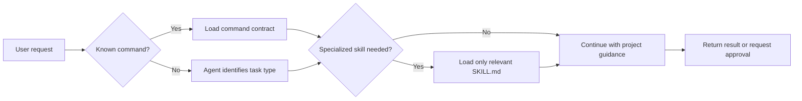
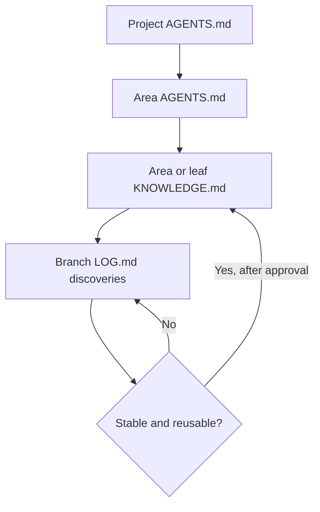
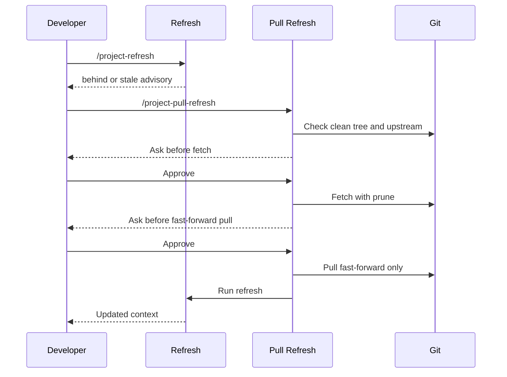
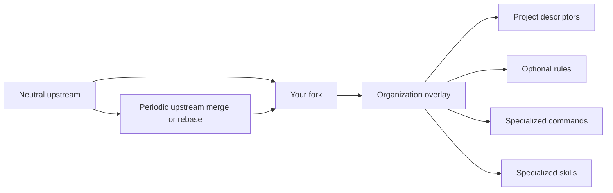
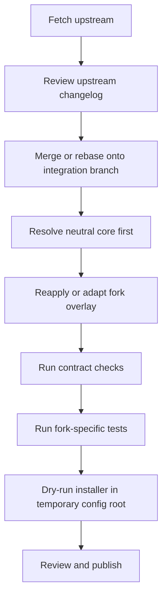

# OpenCode Conductor: In-Depth User and Extension Guide

This guide explains how to install, configure, use, troubleshoot, and extend OpenCode Conductor. It is written for developers who are new to the project and may also be new to agent-assisted development.

The shorter [`README.md`](../README.md) is the quickest starting point. This document goes deeper: it explains why each part exists, what files are written, which operations are read-only, where the safety boundaries are, and how to maintain a fork.

## Table of contents

1. [What the Conductor is](#1-what-the-conductor-is)
2. [The mental model](#2-the-mental-model)
3. [Important vocabulary](#3-important-vocabulary)
4. [Repository layout](#4-repository-layout)
5. [Requirements](#5-requirements)
6. [Installation](#6-installation)
7. [How the installer works](#7-how-the-installer-works)
8. [Registering your first project](#8-registering-your-first-project)
9. [Understanding the descriptor](#9-understanding-the-descriptor)
10. [Global and project-local state](#10-global-and-project-local-state)
11. [Branch helper files](#11-branch-helper-files)
12. [The normal daily workflow](#12-the-normal-daily-workflow)
13. [Command reference](#13-command-reference)
14. [Skills](#14-skills)
15. [Rules and project guidance](#15-rules-and-project-guidance)
16. [The engine and `tools-off`](#16-the-engine-and-tools-off)
17. [Knowledge files](#17-knowledge-files)
18. [Reviews and finding identifiers](#18-reviews-and-finding-identifiers)
19. [Shared branches and synchronization](#19-shared-branches-and-synchronization)
20. [Artifact creation runtime](#20-artifact-creation-runtime)
21. [Upgrading and descriptor migration](#21-upgrading-and-descriptor-migration)
22. [Safety and security model](#22-safety-and-security-model)
23. [Troubleshooting](#23-troubleshooting)
24. [Extending the project through a fork](#24-extending-the-project-through-a-fork)
25. [Future potential additions](#25-future-potential-additions)
26. [Known limitations and potential issues](#26-known-limitations-and-potential-issues)
27. [Practical recipes](#27-practical-recipes)
28. [Operational checklists](#28-operational-checklists)

## 1. What the Conductor is

OpenCode Conductor is a descriptor-driven toolkit for maintaining useful context across coding sessions.

An agent can inspect a repository and work with its code, but a long-running project needs more than a single conversation. Developers need a durable record of:

- what a branch is trying to achieve;
- which work is complete;
- which risks or review findings remain open;
- which project and area rules must be followed;
- which verification commands are authoritative;
- what another developer or agent should read before continuing.

The Conductor provides that durable structure without requiring every project to use the same framework, package manager, model, provider, branch naming style, or repository layout.

It does this with five main building blocks:

- **Descriptors** describe the project and its storage paths.
- **Commands** define user-invokable workflows.
- **Skills** provide specialized instructions that load only when needed.
- **Rules** provide small, reusable operating constraints.
- **Branch helpers and knowledge files** preserve durable context on disk.

The Conductor is not:

- an automatic issue tracker;
- a replacement for Git;
- a background daemon;
- a remote change-request service;
- a project generator that forces a framework;
- a tool that silently edits or deletes branch context during refresh.

## 2. The mental model

Think of the system as four connected layers.



### Layer 1: Control

Commands, skills, and rules tell the agent how to behave.

Examples:

- `/project-refresh` says how to inspect the current branch.
- `review-branch` explains how to perform an evidence-based review.
- `CORE.md` defines general edit and Git safety expectations.

### Layer 2: Configuration

The project descriptor answers questions such as:

- Where is the Git repository?
- What are the project areas?
- Where should branch context be stored?
- Which helper files does this project support?
- Which paths should be excluded from review findings?

### Layer 3: Durable state

Durable state is stored in ordinary files:

- `HELPERS.json` records which branch helpers a branch uses.
- `LOG.md` records checkpoints.
- `PHASES.md` records a staged plan.
- `REVIEW.md` records review findings and triage.
- `MERGE_REQUEST.md` records local change-request context.
- `AGENTS.md` records operating rules.
- `KNOWLEDGE.md` records durable architecture and module facts.

### Layer 4: Execution

The Bun engine performs deterministic refresh and bootstrap work when its wrappers are explicitly enabled. When custom wrappers are unavailable, `/manual-refresh` and the manual fallback in `/project-bootstrap` define equivalent procedures.

## 3. Important vocabulary

| Term | Meaning |
| --- | --- |
| Config root | The directory in `OPENCODE_HOME`, defaulting to `~/.config/opencode`. |
| Descriptor | A project JSON file under `$OPENCODE_HOME/projects/<key>/descriptor.json`. |
| Project key | A short identifier used to find one descriptor. |
| Area | A major repository section such as `frontend`, `backend`, `cli`, or `packages`. |
| Leaf | A meaningful package, module, service, or feature subtree inside an area. |
| Helper | An optional branch-local document declared in descriptor schema v3. |
| Helper role | The semantic purpose of a helper, such as `log`, `review`, `phases`, or `merge_request`. |
| Helper manifest | `HELPERS.json`, which records the helpers selected for one branch. |
| Tracked handoff | A mode that uses selected branch helpers and checkpoints. |
| Lite handoff | A lower-overhead mode that derives context mainly from a recent Git window. |
| Refresh | A read-only inspection of project, branch, helper, review, and synchronization state. |
| Bootstrap | A guarded operation that creates only selected missing helper files. |
| Knowledge promotion | Moving a stable discovery from branch notes into durable knowledge after approval. |
| Wrapper | A small tool entry point that calls the shared Bun engine. |
| Manual lane | A documented workflow used when wrappers are not enabled. |

## 4. Repository layout

The most important repository paths are:

```text
opencode-conductor/
├── bin/
│   ├── install-opencode-conductor.sh
│   └── migrate-helper-registry.py
├── commands/
│   └── *.md
├── descriptors/
│   ├── descriptor.template.json
│   └── examples/
├── documentation/
│   ├── USER_GUIDE.md
│   ├── ARCHITECTURE.md
│   ├── DESCRIPTOR_REFERENCE.md
│   ├── HELP_DOCS_AUTHORING.md
│   ├── PATH_CONTRACT.md
│   ├── WORKFLOW.md
│   └── ...
├── project-rules/
│   ├── AGENTS.md
│   └── README.md
├── rules/
│   └── *.md
├── runtime/
│   ├── node-packages.txt
│   ├── python-requirements.txt
│   └── python-requirements-pdf-engines.txt
├── skills/
│   └── <skill-name>/
│       ├── SKILL.md
│       └── optional scripts or assets
├── templates/
│   ├── knowledge/
│   └── mr/
├── tests/
│   └── contract_checks.py
├── tools-off/
│   ├── _opencode_engine.ts
│   ├── opencode_bootstrap_branch.ts
│   └── opencode_refresh_context.ts
└── opencode.json.template
```

The `documentation/` directory is the single maintained documentation tree. It
contains both concise contracts and longer tutorial material, so links remain
useful when the repository is viewed directly and do not depend on a particular
documentation-site generator.

## 5. Requirements

### Base installation

The base installer needs:

- a POSIX-style shell environment;
- Bash;
- Python 3 for safe JSON rendering and merging;
- a writable config root.

### Executable engine

The engine and its behavioral tests use Bun. The manual lane remains available when Bun or custom tool loading is unavailable.

### Optional artifact runtime

Artifact skills need additional software:

- Python 3.10 or newer;
- Node.js 20.17 or newer;
- optional system tools such as LibreOffice, Poppler, qpdf, Tesseract, and pandoc;
- optional PDF engines when advanced conversion is needed.

The base installation does not install these dependencies unless you request them.

## 6. Installation

### 6.1 Preview first

Start with a dry run:

```bash
bash bin/install-opencode-conductor.sh --dry-run
```

The dry run shows which files would be copied or created. It does not write to the config root.

### 6.2 Standard installation

```bash
bash bin/install-opencode-conductor.sh
```

The default config root is:

```text
~/.config/opencode
```

To use a different root:

```bash
OPENCODE_HOME=/absolute/path/to/config \
  bash bin/install-opencode-conductor.sh
```

The target must be an absolute, non-root path. The installer refuses `/`, the home directory itself, relative paths, and unsafe targets.

### 6.3 Installer options

| Option | What it does |
| --- | --- |
| `--dry-run` | Previews the installation without writing. |
| `--seed-agents DIR` | Creates a generic `AGENTS.md` in an existing project or subtree if none exists. |
| `--no-seed-agents` | Disables the interactive guidance-seed prompt. |
| `--with-runtime-deps` | Creates or updates the central Python and Node artifact runtime. |
| `--with-pdf-engines` | Adds optional Python PDF conversion engines; requires `--with-runtime-deps`. |
| `--with-system-deps` | Installs supported system tools where automatic installation exists; requires `--with-runtime-deps`. |
| `--auto-node` | Attempts to install or select a suitable Node version with an available version manager. |
| `--with-templates` | Deprecated compatibility option; templates now always synchronize. |
| `--help` | Prints installer help. |

### 6.4 Optional project guidance prompt

In an interactive terminal, the installer may ask:

```text
Seed a generic AGENTS.md into an existing project directory? [y/N]
```

If you answer yes, you may provide:

- the project root; or
- a specific source subtree that needs its own operating instructions.

The installer never overwrites an existing `AGENTS.md`.

After seeding, edit the file. Add project-owned information such as:

- authoritative test and type-check commands;
- package boundaries;
- directories that must not be edited;
- security rules;
- naming conventions;
- deployment or migration requirements.

The seed is deliberately sparse. It is not intended to guess your project conventions.

## 7. How the installer works

The installer follows a predictable sequence.



### 7.1 Configuration creation and merge

The canonical source is [`opencode.json.template`](../opencode.json.template).

For a new installation, the installer:

1. relocates default config-root paths when a custom `OPENCODE_HOME` is used;
2. writes formatted JSON;
3. uses restrictive file permissions;
4. does not add provider credentials or model pins.

For an existing installation, the installer:

1. parses the current JSON;
2. recursively adds missing toolkit entries;
3. preserves existing values;
4. preserves local provider and routing configuration;
5. preserves custom instructions;
6. sets the configuration file to mode `0600`.

The merge is additive. It does not delete unknown local entries.

If `opencode.json` is a symbolic link, the installer preserves it and asks the user to merge manually rather than following the link.

### 7.2 Asset synchronization

The installer synchronizes:

- `rules/`;
- `commands/`;
- `skills/`;
- `templates/mr/`;
- `templates/knowledge/`;
- `project-rules/`;
- `runtime/`;
- `tools-off/`.

Destination paths reached through symbolic links are preserved instead of being overwritten.

### 7.3 Known obsolete files

Only specifically recognized obsolete files are archived. They are moved under:

```text
$OPENCODE_HOME/backups/opencode-conductor/legacy/
```

This is safer than deleting every unrecognized file in an old directory. Local extensions remain project-owned.

### 7.4 Runtime isolation

With `--with-runtime-deps`, the installer creates:

```text
$OPENCODE_HOME/
├── .venv/
├── bin/
│   ├── opencode-python
│   ├── opencode-pip
│   ├── opencode-node
│   └── opencode-npm
├── runtime/
│   └── node/
├── runtime.env
└── runtime-env.sh
```

Important properties:

- Python dependencies do not install into the active project repository.
- Node dependencies install under `runtime/node`, not at the config root.
- a project `.env` is never read or replaced;
- generated activation files have explicit runtime names;
- runtime setup refuses descendant symbolic links.

## 8. Registering your first project

After installation, enter the repository you want to manage and run:

```text
/project-init my-project
```

The command:

1. locates the Git root;
2. scans for likely areas;
3. detects common package and configuration signals;
4. resolves the integration branch when possible;
5. asks where durable state should live;
6. drafts a complete schema v3 descriptor;
7. shows the JSON before writing;
8. writes only after explicit approval;
9. copies branch-helper templates without replacing existing files.

Initialization does not generate project or area rules. Those remain project-owned and may be seeded separately with the installer.

If a descriptor already exists, initialization preserves it and stops. Use the migration utility for an older schema or make an explicit reviewed edit to an existing schema v3 descriptor.

### First-project flow



## 9. Understanding the descriptor

The descriptor is the control plane for one project.

Its fixed location is:

```text
$OPENCODE_HOME/projects/<projectKey>/descriptor.json
```

Here is a reduced schema v3 example:

```json
{
  "projectKey": "my-project",
  "descriptorSchemaVersion": 3,
  "projectRootPath": "~/projects/my-project",
  "opencodeProjectRootPath": "~/.config/opencode/projects/my-project",
  "projectAgentsPath": "~/projects/my-project/AGENTS.md",
  "baselineBranchForMaterialChanges": "main",
  "handoffModeDefault": "tracked",
  "reviewIgnoredPathGlobs": [
    "**/generated/**",
    "**/*.snap"
  ],
  "branchSyncStaleAfterMinutes": 60,
  "areas": {
    "frontend": {
      "pathPrefix": "frontend",
      "areaAgentsPath": "~/projects/my-project/frontend/AGENTS.md"
    },
    "backend": {
      "pathPrefix": "backend",
      "areaAgentsPath": "~/projects/my-project/backend/AGENTS.md"
    }
  },
  "branchHandoff": {
    "contextDirTemplate": "~/.config/opencode/projects/{projectKey}/branches/{branchName}",
    "templatesDir": "~/.config/opencode/projects/{projectKey}/_templates/mr",
    "helperManifestFilename": "HELPERS.json",
    "checkpointField": "reviewed_through",
    "helpers": {
      "log": {
        "filename": "LOG.md",
        "templateFilename": "LOG.md",
        "role": "log",
        "bootstrap": "ask",
        "description": "Progress log for checkpoints and handoffs."
      },
      "review": {
        "filename": "REVIEW.md",
        "role": "review",
        "bootstrap": "never",
        "description": "Structured review findings and triage."
      }
    }
  }
}
```

### 9.1 Core fields

| Field | Purpose |
| --- | --- |
| `projectKey` | Must match the key used to load the descriptor. |
| `descriptorSchemaVersion` | `3` for new projects; schemas 1 and 2 remain readable. |
| `projectRootPath` | Absolute or home-relative path to the Git project. |
| `opencodeProjectRootPath` | Root for generated project state and leaf knowledge. |
| `projectAgentsPath` | Project-owned operating rules. |
| `baselineBranchForMaterialChanges` | Integration branch fallback. |
| `handoffModeDefault` | `tracked` or `lite`. |
| `reviewIgnoredPathGlobs` | Paths visible in review scope but excluded from findings. |
| `branchSyncStaleAfterMinutes` | Local remote-reference age warning threshold. |
| `areas` | Major source regions and their guidance paths. |
| `pseudoPackageDetection` | Ordered rules for identifying meaningful leaves. |
| `trackedKnowledgeTargets` | Optional overrides for knowledge paths. |
| `branchHandoff` | Branch helper registry, templates, paths, and checkpoint field. |

### 9.2 Helper definitions

Each helper definition includes:

- an ID, taken from the object key;
- a safe filename;
- an optional template filename;
- a semantic role;
- a bootstrap policy;
- a plain-language description.

Bootstrap policies mean:

| Policy | Meaning |
| --- | --- |
| `always` | Default selection for compatible automated bootstrap flows. |
| `ask` | Offer the helper to the user. |
| `never` | Do not create unless the user explicitly selects it. |

Schema v3 supports additional project-defined helpers, for example:

```json
{
  "decisionLog": {
    "filename": "DECISIONS.md",
    "templateFilename": "DECISIONS.md",
    "role": "notes",
    "bootstrap": "ask",
    "description": "Branch-local architecture decisions and consequences."
  }
}
```

## 10. Global and project-local state

The descriptor always remains under `OPENCODE_HOME`. The data paths inside it can point elsewhere.

### Global state

Typical layout:

```text
$OPENCODE_HOME/projects/my-project/
├── descriptor.json
├── _templates/
├── branches/
└── frontend/
```

Use global state when:

- you want no repository noise;
- the context is mainly private;
- one local configuration should serve the project.

### Project-local state

Typical layout:

```text
<project-root>/.opencode-conductor/
├── _templates/
├── branches/
└── knowledge mirrors
```

Use project-local state when:

- separate checkouts need separate context;
- context should travel with a checkout;
- selected context should be committed and reviewed;
- the team has an out-of-band sharing convention.

Project-local state may be:

- Git-tracked;
- ignored;
- temporarily untracked.

Git tracking, not the location label alone, determines whether knowledge moves between branches.

### Storage decision diagram



## 11. Branch helper files

Helpers are optional and selected per branch.

Common helpers are:

| Role | Common filename | Purpose |
| --- | --- | --- |
| `merge_request` | `MERGE_REQUEST.md` | Goal, scope, acceptance criteria, and reviewer context. |
| `log` | `LOG.md` | Append-only checkpoints and session handoffs. |
| `phases` | `PHASES.md` | Staged plan, active phase, and exit criteria. |
| `review` | `REVIEW.md` | Findings, triage, review metadata, and suggested verification. |
| `notes` | Project-defined | Decisions or other branch-local records. |

### 11.1 The helper manifest

`HELPERS.json` records branch intent:

```json
{
  "schemaVersion": 1,
  "helpers": {
    "log": {
      "path": "LOG.md",
      "state": "present",
      "updatedAt": "2026-01-01T12:00:00Z",
      "lastSeenAt": "2026-01-01T12:00:00Z"
    }
  }
}
```

Possible states:

- `present`: the branch intends to use the helper;
- `missing`: the helper is tracked but no longer exists;
- `removed`: the branch intentionally stopped using the helper.

### 11.2 Reconciliation states

Refresh compares:

1. descriptor support;
2. manifest intent;
3. filesystem reality.

It reports:

- supported helpers;
- tracked helpers;
- existing helpers;
- missing helpers;
- untracked helpers;
- unsupported helpers;
- available helpers;
- intentionally removed helpers;
- helper drift;
- manifest errors.

Refresh never repairs these states automatically. Use `/project-helper` to make an explicit choice.

### 11.3 Safe bootstrap

Bootstrap:

- preflights every selected helper before writing;
- refuses path escapes and symbolic links;
- refuses malformed existing manifests;
- refuses missing declared templates;
- never overwrites an existing helper;
- creates files with owner-only permissions;
- updates the manifest atomically;
- removes only files created by the failed attempt if a later write fails.

## 12. The normal daily workflow

### 12.1 First visit to a branch

```text
/project-refresh my-project
```

If the branch has no selected helpers:

```text
/project-bootstrap my-project
```

Then refresh again.

### 12.2 Normal work cycle



### 12.3 Why refresh is separate from pull

`/project-refresh` is read-only and local. It does not contact a remote.

`/project-pull-refresh` is network-aware. It asks before fetch or pull, checks the working tree, refuses divergence, and uses fast-forward-only pull behavior.

This separation prevents a harmless request for status from unexpectedly changing Git state.

## 13. Command reference

Commands are Markdown contracts installed under `$OPENCODE_HOME/commands/`.

### 13.1 Project and context commands

#### `/project-init <projectKey>`

Use when registering a repository for the first time.

It:

- scans the repository;
- proposes areas and state location;
- drafts a schema v3 descriptor;
- asks for approval;
- writes the descriptor and helper templates.

It does not overwrite an existing descriptor.

#### `/project-state [<projectKey>]`

Use for a concise, read-only status report.

It reports:

- working-tree state;
- branch and integration base;
- upstream divergence;
- local remote-reference staleness;
- knowledge drift;
- managed stash entries;
- recent kickoff audit.

#### `/project-refresh <projectKey>`

Use when the Bun refresh wrapper is enabled.

It reports structured branch context without writing or fetching.

#### `/manual-refresh <projectKey>`

Use when custom wrappers are unavailable.

It follows the documented refresh contract manually and returns the same conceptual fields.

#### `/project-pull-refresh <projectKey>`

Use when local remote references may be stale or the branch may be behind.

It:

- inspects the working tree;
- asks before network operations;
- runs fetch with pruning after approval;
- allows only fast-forward pull;
- refuses dirty or diverged state;
- runs refresh afterward.

#### `/project-bootstrap <projectKey>`

Use to select and safely create branch helpers.

It can use an explicitly enabled wrapper or its full manual fallback.

#### `/project-helper <projectKey>`

Use after refresh reports helper drift or when you want to change helper selection.

Actions include:

- create helpers;
- recreate a missing helper;
- relink a moved helper;
- mark a helper removed;
- show status only.

It never deletes helper files by default.

### 13.2 Branch lifecycle commands

#### `/project-branch-new [<branch>]`

Use to create a new branch from the latest integration base.

It asks separately before:

- fetch;
- checking out the base;
- fast-forward pull;
- branch creation.

It refuses dirty state, unsafe names, destructive reset, and force operations.

#### `/project-branch-kickoff [<projectKey>]`

Use for a large branch that benefits from:

- phase planning;
- selected helper setup;
- seed material;
- knowledge discovery;
- a structured audit trail.

For a small branch, prefer bootstrap plus focused implementation.

#### `/project-branch-explore [<branch>]`

Use to switch to and understand a branch manually.

It produces `EXPLORE_GUIDE.md` with:

- setup;
- what changed;
- how to try the feature;
- caveats.

It does not perform browser automation.

#### `/project-phases <projectKey>`

Use to create or refine `PHASES.md`.

It supports:

- AI-drafted;
- user-led;
- hybrid planning;
- optional dependency diagrams;
- active phase and exit criteria;
- a no-write mode recommendation.

#### `/project-checkpoint <projectKey>`

Use after substantial work or before a pause.

It appends to the progress-log helper and may propose narrowly evidenced phase progress.

#### `/project-close <projectKey>`

Use at the end of a session.

It adds a concise summary and the single most important next step when a progress-log helper exists.

#### `/project-cleanup-candidates <projectKey>`

Use to report potentially stale branch context directories.

It is read-only. Removal still requires a separate explicit decision.

### 13.3 Review and change-request commands

#### `/project-review <projectKey>`

Use for a structured branch review.

It:

- refreshes context;
- partitions reviewable and ignored paths;
- runs a report-only knowledge preflight;
- preserves existing triage by default;
- writes or updates the review helper;
- suggests project-backed verification.

#### `/project-review-sync <projectKey>`

Use after commits or narrative changes when a full review regeneration is unnecessary.

It preserves findings and synchronizes current review/change-request state.

#### `/project-update-mr <projectKey>`

Use to refresh local change-request context.

It separates:

- protected human narrative;
- machine-managed `## OpenCode:` sections.

It never pushes a branch or updates a remote change request by itself.

### 13.4 Knowledge and documentation commands

#### `/scaffold-knowledge <projectKey> [list|dry-run|discovery]`

Use to discover and create sparse leaf `KNOWLEDGE.md` files.

It:

- derives paths from descriptor package rules;
- checks source existence;
- refuses unsafe names and symbolic links;
- refuses top-level knowledge writes;
- never overwrites an existing knowledge file.

#### `/project-knowledge-refresh <projectKey>`

Use after discovering stable architecture, conventions, invariants, or pitfalls.

It produces a proposal first. Each target requires explicit approval before writing.

#### `/project-help-docs <output-root>`

Use to generate end-user documentation from code.

It supports:

- scoped output;
- audience labels;
- vocabulary replacements;
- banned-term checks;
- optional frontmatter;
- optional Mermaid diagrams;
- output containment;
- pre-write secret checks.

### 13.5 Verification commands

#### `/check-types [area]`

Finds the project-backed type-check command from guidance, manifests, task files, CI, or contributor documentation. It reports errors without modifying source.

#### `/run-tests [area]`

Runs the project-backed test command with optional filter/watch behavior. It reports failures without editing code.

#### `/run-playwright-tests [scope]`

Plans and runs project-defined Playwright end-to-end tests after prerequisite and environment checks.

#### `/lint-fix [area]`

Runs the project's configured fix-capable lint command. It validates scope and reports remaining issues.

#### `/organize-imports`

Uses the project's configured import organizer. It does not impose a separate import ordering policy.

### 13.6 Guided implementation commands

#### `/add-gql-mutation`

Discovers the repository's existing graph-mutation pattern before creating a matching implementation and tests.

#### `/add-table-column`

Discovers the existing data-table column pattern before adding one conservatively.

#### `/extract-component`

Extracts a component while following local placement, typing, styling, and import conventions.

#### `/migrate-to-flex-wrapper`

Finds established row/column wrapper components and replaces provably equivalent manual flex containers. It stops when mappings are ambiguous.

## 14. Skills

A skill is an on-demand procedure stored in `skills/<name>/SKILL.md`.

Commands and skills are different:

- A **command** is explicitly invoked by the user.
- A **skill** is loaded when a task needs a specialized lens.
- A **rule** is active whenever enabled in configuration.



### 14.1 Engineering and lifecycle skills

| Skill | Purpose |
| --- | --- |
| `git-safety` | Checks Git preconditions and confirmation boundaries. |
| `branch-kickoff` | Coordinates a safe large-branch startup. |
| `branch-explore` | Produces an evidence-based branch exploration guide. |
| `session-lifecycle` | Selects refresh, checkpoint, and close behavior. |
| `discover-knowledge` | Separates durable knowledge from branch-specific notes. |
| `onboard-area` | Builds a mental model of an unfamiliar source area. |
| `plan-phases` | Drafts staged deliverables, risks, and exit criteria. |
| `review-branch` | Performs evidence-driven review and triage. |
| `verify-changes` | Chooses the narrowest project-backed checks. |
| `systematic-debugging` | Moves from reproduction to root cause through explicit hypotheses. |
| `refactor-safely` | Breaks refactors into reversible, verified steps. |
| `write-tests` | Selects test boundaries, scenarios, and assertions. |
| `add-feature-module` | Discovers and follows a repository's feature/module pattern. |
| `debug-gql-query` | Traces graph-query behavior across layers. |
| `playwright-e2e` | Plans and executes browser end-to-end tests safely. |
| `help-docs-author` | Generates source-backed end-user documentation. |

### 14.2 Artifact skills

| Skill | Purpose |
| --- | --- |
| `canvas-design` | Creates original static visual compositions. |
| `convert-to-pdf` | Converts supported source formats into PDF. |
| `docx` | Creates, edits, comments on, and validates Word-compatible documents. |
| `pdf` | Reads, creates, fills, transforms, and inspects PDF files. |
| `pptx` | Creates and edits presentation decks. |
| `xlsx` | Creates, edits, recalculates, and validates workbooks. |
| `slack-gif-creator` | Creates compact animated GIFs for chat use. |

### 14.3 Skill loading discipline

Skills are intentionally not all loaded at once. This:

- reduces prompt size;
- avoids unrelated instructions influencing a task;
- makes behavior easier to audit;
- lets specialized capabilities carry detailed instructions and scripts.

Skills normally do not load other skills. `git-safety` is the documented foundational exception for workflows that may mutate Git.

## 15. Rules and project guidance

Rules live under `rules/`. They should be short because enabled rules are present throughout a session.

### 15.1 Included rule modules

| Rule | Purpose | Default template |
| --- | --- | --- |
| `CORE.md` | Communication, edit discipline, verification, and Git consent. | Enabled |
| `SENIOR_ENGINEERING.md` | Architecture, systems, craft, risk, and trade-off lens. | Enabled |
| `CODE_QUALITY.md` | General control-flow, typing, module, error, and test defaults. | Enabled |
| `HANDOFF_GENERIC.md` | Descriptor-driven refresh and branch-context lifecycle. | Enabled |
| `FRONTEND.md` | Optional frontend-specific guidance that defers to project tooling. | Not enabled by default |

The default instruction registry is in [`opencode.json.template`](../opencode.json.template).

### 15.2 Rule precedence

Use this order when instructions disagree:

1. system or host safety requirements;
2. explicit current user request;
3. project-owned `AGENTS.md`;
4. area `AGENTS.md`;
5. enabled generic rules;
6. a skill's defaults;
7. general preference.

Project guidance should override generic style preferences when it is safe and explicit.

### 15.3 What belongs in project `AGENTS.md`

Good content includes:

- exact verification commands;
- directory boundaries;
- generated-file policy;
- schema and migration rules;
- required review steps;
- commit or branch conventions;
- security classifications;
- ownership and escalation paths.

Avoid putting temporary ticket details into `AGENTS.md`. Those belong in branch helpers.

## 16. The engine and `tools-off`

The shared engine is:

```text
tools-off/_opencode_engine.ts
```

The wrappers are:

```text
tools-off/opencode_bootstrap_branch.ts
tools-off/opencode_refresh_context.ts
```

### 16.1 Why the directory is named `tools-off`

Some hosts automatically expose every source file under a directory named `tools`.

The shared engine is an internal module, not a user-facing tool. Keeping all sources under `tools-off`:

- prevents accidental registration;
- keeps activation explicit;
- avoids exposing internal functions;
- provides one standard installation layout;
- makes the manual lane the safe default.

### 16.2 Engine responsibilities

The engine:

- loads and validates descriptors;
- supports descriptor schemas 1, 2, and 3;
- verifies repository membership;
- resolves branch context;
- normalizes the helper registry;
- reconciles manifest and filesystem state;
- performs safe helper bootstrap;
- calculates Git change windows;
- partitions reviewable and ignored paths;
- parses review metadata and open findings;
- reports local upstream divergence;
- calculates remote-reference staleness;
- returns structured JSON.

### 16.3 Explicit activation

Custom tool-loading differs between hosts. The repository deliberately does not assume one global registration method.

If your host supports custom wrappers:

1. explicitly load only the two wrapper entry points;
2. do not register `_opencode_engine.ts` directly;
3. keep the wrappers in `tools-off`;
4. verify the wrapper names match the command contracts;
5. test with one read-only refresh before enabling bootstrap.

If wrappers are not available:

- use `/manual-refresh`;
- use `/project-bootstrap` and follow its manual fallback;
- continue using all file- and Git-based commands normally.

### 16.4 Refresh output shape

Refresh includes categories such as:

- project and descriptor versions;
- branch and checkpoint;
- changed areas and files;
- ignored/reviewable partitions;
- helper state;
- review state;
- upstream state;
- context storage mode;
- recommended reconciliation;
- ordered files to reread;
- risks and next steps.

See [`PATH_CONTRACT.md`](PATH_CONTRACT.md) for the normative field contract.

## 17. Knowledge files

The knowledge hierarchy separates instructions from facts.



### 17.1 `AGENTS.md`

Use for operating instructions:

- what commands to run;
- what not to edit;
- required checks;
- naming and boundary rules;
- security or migration procedures.

### 17.2 `KNOWLEDGE.md`

Use for durable facts:

- purpose;
- public surface;
- internal layout;
- invariants;
- dependencies;
- architectural patterns;
- known pitfalls;
- verification relevant to the leaf.

### 17.3 Branch `LOG.md`

Use for temporary or branch-specific discoveries:

- what was tried;
- current debugging state;
- temporary workarounds;
- ticket-specific decisions;
- unverified hypotheses;
- next-session steps.

### 17.4 Promotion rule

Promote a discovery only when it is:

- stable across branches;
- likely to remain true;
- useful to future developers;
- supported by code or documentation evidence;
- free of secrets and environment-specific paths.

`/project-knowledge-refresh` proposes changes before writing them.

## 18. Reviews and finding identifiers

### 18.1 Review lifecycle

Review state can be:

| State | Meaning |
| --- | --- |
| `new_review` | No review helper exists. |
| `existing_current` | The recorded reviewed head equals current `HEAD`. |
| `existing_head_moved` | New commits exist after the recorded review. |
| `existing_unknown_head` | A review exists but lacks usable head metadata. |

Existing findings and triage are preserved by default.

### 18.2 Finding namespaces

New findings use:

- `F###` for implementation findings;
- `R###` for review-process or verification findings;
- `M###` for metadata, knowledge, or drift findings.

Older identifiers already present in a review remain valid and are not renumbered.

### 18.3 Ignored review paths

`reviewIgnoredPathGlobs` does not hide paths completely.

Refresh creates two disjoint sets:

- reviewable paths;
- ignored paths.

Both counts and bounded previews remain visible. Ignored paths do not receive ordinary findings, but reviewers can still see that they changed.

### 18.4 Review synchronization

Use:

```text
/project-review-sync <projectKey>
```

when:

- new commits were added;
- a review already exists;
- preserving triage is important;
- only current status and deltas need synchronization.

Use a full `/project-review` when scope or risk changed materially.

## 19. Shared branches and synchronization

Refresh inspects local refs only.

Possible synchronization states:

- `up_to_date`;
- `behind`;
- `ahead`;
- `diverged`;
- `no_upstream`;
- `unknown`.

Remote-reference freshness is inferred from `FETCH_HEAD` age. It is an advisory, not proof that a remote changed.

### Safe shared-branch flow



For shared helpers:

- keep progress logs append-only;
- avoid multiple developers changing phase status simultaneously;
- preserve review triage during conflicts;
- never merge two different branch-context roots automatically;
- use explicit user decisions for relinking or marking helpers removed.

## 20. Artifact creation runtime

Artifact skills are large because they include scripts, schemas, fonts, and validation helpers.

### 20.1 Install the runtime

```bash
bash bin/install-opencode-conductor.sh --with-runtime-deps
```

Optional PDF engines:

```bash
bash bin/install-opencode-conductor.sh \
  --with-runtime-deps \
  --with-pdf-engines
```

Supported automatic system tools where available:

```bash
bash bin/install-opencode-conductor.sh \
  --with-runtime-deps \
  --with-system-deps
```

### 20.2 Runtime wrappers

Use the generated wrappers instead of installing packages into a project:

```text
$OPENCODE_HOME/bin/opencode-python
$OPENCODE_HOME/bin/opencode-pip
$OPENCODE_HOME/bin/opencode-node
$OPENCODE_HOME/bin/opencode-npm
```

### 20.3 Archive and conversion safety

Office-related skills:

- reject archive path traversal;
- reject absolute and drive-qualified member paths;
- reject symbolic-link and special-file archive entries;
- limit member count and extracted size;
- isolate temporary files;
- validate generated documents;
- keep the LibreOffice shim in an owner-only cache;
- refuse symbolic-link shim caches.

Generated artifacts should be written to the user's project or requested output directory, not inside the installed skill folder.

## 21. Upgrading and descriptor migration

### 21.1 Upgrade the installed files

After updating the repository:

```bash
bash bin/install-opencode-conductor.sh --dry-run
bash bin/install-opencode-conductor.sh
```

The installer:

- adds missing configuration;
- preserves local values;
- synchronizes current assets;
- archives only known obsolete files.

### 21.2 Descriptor compatibility

| Schema | Package detection | Helper model | Status |
| --- | --- | --- | --- |
| v1 | One object or omitted | Fixed filenames | Read-compatible |
| v2 | Ordered rule array | Fixed filenames | Read-compatible |
| v3 | Ordered rule array | Helper registry and manifest | Current |

Migration is optional because the engine remains read-compatible.

### 21.3 Preview migration

```bash
python3 bin/migrate-helper-registry.py --project-key my-project
```

Review:

- proposed descriptor changes;
- discovered branch folders;
- helpers that would be tracked;
- ambiguous files;
- malformed manifests;
- symbolic-link refusals.

### 21.4 Apply migration

```bash
python3 bin/migrate-helper-registry.py \
  --project-key my-project \
  --apply
```

The migration:

- preserves legacy descriptor fields;
- discovers nested branch names;
- creates manifests atomically;
- skips malformed manifests;
- refuses helper/manifest symbolic links;
- never deletes helper files;
- is idempotent when state is already current.

## 22. Safety and security model

### 22.1 Read-only means read-only

Refresh commands do not:

- fetch;
- pull;
- run tests;
- create helpers;
- rewrite manifests;
- edit reviews;
- promote knowledge.

### 22.2 Git mutation requires confirmation

Branch lifecycle commands ask before meaningful Git mutations. They do not:

- force-push;
- hard reset;
- run destructive clean;
- auto-stash;
- silently switch branches.

### 22.3 Path safety

The engine and installer:

- reject root targets;
- validate project keys and branch names;
- reject unsafe relative paths;
- reject path traversal;
- inspect symbolic links;
- keep helper writes inside the branch context root;
- keep template reads inside the template root;
- preserve malformed state for repair.

### 22.4 Atomic writes

Sensitive JSON state is written through unique temporary files and installed atomically.

Atomicity prevents partial files, but it does not provide multi-process locking. See [Known limitations and potential issues](#26-known-limitations-and-potential-issues).

### 22.5 Secrets

Do not place secrets in:

- descriptors;
- branch helpers;
- knowledge files;
- generated help documentation;
- audit blocks.

Knowledge and documentation workflows include pre-write scans for common credential shapes, but scans are a defense-in-depth measure, not a substitute for secret management.

## 23. Troubleshooting

| Symptom or reason | Meaning | Recommended response |
| --- | --- | --- |
| `descriptor_not_found` | No descriptor exists for the project key. | Run `/project-init <key>` or copy and edit the template. |
| `invalid_descriptor_json` | Descriptor JSON cannot be parsed. | Repair the file; do not run migration until valid. |
| `descriptor_project_key_mismatch` | File key differs from requested key. | Correct the key or use the matching command argument. |
| `workspace_not_in_project` | Current Git root does not match `projectRootPath`. | Change directory or correct the descriptor path. |
| `detached_head` | Git is not on a named branch. | Check out a branch before branch-context operations. |
| `invalid_branch_name` | Branch cannot be safely mapped to context. | Rename or check out a safe branch. |
| `invalid_helper_manifest` | `HELPERS.json` is malformed or unsafe. | Preserve it, repair or move it, then retry. |
| `missing_helper_template` | A selected helper declares a template that is absent. | Install/copy the template or adjust the descriptor. |
| `unsafe_helper_path` | A helper path escapes its root or is a symbolic link/non-file. | Repair the path; do not bypass the check. |
| `helper_selection_required` | Bootstrap has no selected/default helpers. | Select at least one supported helper. |
| `unknown_helper_ids` | A selected ID is not in the descriptor. | Choose from `supported_helpers`. |
| `branch_sync_state: behind` | Local branch is behind its local upstream ref. | Use `/project-pull-refresh`. |
| `branch_sync_state: diverged` | Local and upstream both have unique commits. | Reconcile manually; fast-forward pull is refused. |
| `remote_ref_may_be_stale: true` | Last fetch is older than the configured threshold. | Consider `/project-pull-refresh`. |
| `source_missing` | A knowledge leaf has no matching source on this branch. | Skip it or use the explicit override only when intentional. |
| Artifact import error | Central runtime dependency is missing. | Rerun installer with `--with-runtime-deps`. |
| PDF engine unavailable | Optional converter is not installed. | Install only the engine you intend to use. |
| Tool name unavailable | Wrappers are not enabled in the host. | Use `/manual-refresh` and manual bootstrap fallback. |

### Debugging order

When something fails:

1. read the exact structured reason;
2. inspect the exact path reported;
3. run `/project-state`;
4. validate descriptor JSON;
5. run `/manual-refresh` to separate wrapper problems from data problems;
6. check Git status and branch attachment;
7. run the contract suite if developing the toolkit.

## 24. Extending the project through a fork

A fork is appropriate when you need organization- or product-specific behavior that should not enter the neutral core.

### 24.1 Fork architecture



Keep the boundary explicit:

- neutral capabilities stay reusable;
- product names, internal paths, and service assumptions stay in the fork;
- project-specific defaults stay in descriptors or project guidance;
- credentials never enter either repository.

### 24.2 Recommended fork workflow

1. Fork the repository.
2. Add the original repository as an `upstream` remote.
3. Keep fork-only work in clearly named commits or directories.
4. Avoid editing shared engine behavior when a descriptor field can express the difference.
5. Add tests for every fork-only assumption.
6. Periodically fetch and integrate upstream changes.
7. Resolve documentation and configuration changes deliberately.
8. Run the complete contract suite after synchronization.

Example remote setup:

```bash
git remote add upstream <upstream-repository-url>
git fetch upstream
```

### 24.3 Add a command

1. Create `commands/<name>.md`.
2. Add frontmatter with `description` and the correct `subtask` behavior.
3. Define arguments and reject unknown ones.
4. Name every mutation and confirmation boundary.
5. Add a structured output format.
6. Add recovery steps.
7. Register it in `opencode.json.template`.
8. Add it to the command reference.
9. Add behavioral or source-contract tests.

Commands should discover project conventions before editing. Do not hardcode a framework or import path unless the command belongs only to your fork.

### 24.4 Add a skill

1. Create `skills/<name>/SKILL.md`.
2. Set frontmatter `name` to the directory name.
3. Write a narrow description that makes triggering clear.
4. Explain inputs, outputs, mutations, and exclusions.
5. Add scripts/assets only when they materially help.
6. Register the skill permission in `opencode.json.template`.
7. Update the skill catalog and tests.

Avoid recursive skill loading. Keep specialized dependencies isolated.

### 24.5 Add a rule

1. Create `rules/<NAME>.md`.
2. Keep it short.
3. State which projects/stacks it applies to.
4. Defer to project guidance and configured tooling.
5. Enable it by default only if it is safe for nearly every project.

Product- or organization-specific rules are good fork overlays and poor neutral defaults.

### 24.6 Add a helper role or helper definition

For a helper using existing semantics, add it to the descriptor:

```json
{
  "architectureNotes": {
    "filename": "ARCHITECTURE_NOTES.md",
    "templateFilename": "ARCHITECTURE_NOTES.md",
    "role": "notes",
    "bootstrap": "ask",
    "description": "Branch-specific architectural notes."
  }
}
```

Also add its template to the project's template directory.

If introducing a new semantic role:

1. update engine role validation;
2. define how refresh orders and reports it;
3. update manual refresh/bootstrap;
4. update migration behavior;
5. update descriptor documentation;
6. add v1/v2 compatibility tests if relevant.

### 24.7 Extend package detection

Add ordered `pseudoPackageDetection` rules.

Each rule should:

- name an existing area;
- provide a safe relative path pattern;
- include `{packageName}` when it should produce leaf knowledge;
- avoid overlap where possible.

When several rules match, the longest matching stem wins and descriptor order breaks ties.

### 24.8 Extend the engine

Before editing `_opencode_engine.ts`, ask:

- Can this be a descriptor field?
- Can this be a new command that uses existing output?
- Does it change the refresh contract?
- Does the manual lane need the same change?
- Does it affect schema compatibility?
- Does it create a new write target?

Every engine change should include:

- a behavioral test;
- a manual-lane update;
- a path/security review;
- descriptor validation;
- documentation changes.

### 24.9 Keeping a fork synchronized

Prefer a repeatable integration process:



Keep fork-only changes easy to identify. A separate overlay directory or a small series of focused commits is easier to maintain than mixing product assumptions throughout generic files.

## 25. Future potential additions

The following additions would improve the project while preserving neutrality.

### 25.1 Supported CLI

Create a stable CLI that exposes:

- refresh;
- bootstrap;
- descriptor validation;
- helper status;
- migration preview;
- documentation/catalog generation.

The CLI should call the same shared engine as wrappers. This would reduce dependence on host-specific tool registration and make the manual lane easier to validate.

### 25.2 Generated contracts and documentation

Generate:

- command catalogs from frontmatter and registry;
- skill catalogs from `SKILL.md`;
- descriptor reference tables from a schema;
- refresh output documentation from shared types.

This would reduce semantic drift between executable behavior and prose.

### 25.3 JSON Schema

Publish schemas for:

- project descriptors;
- helper manifests;
- refresh output;
- review metadata.

Editor validation would help junior developers catch errors before running a command.

### 25.4 Reproducible runtime locks

Add:

- Python lock files with hashes;
- a Node lockfile;
- dependency update automation;
- vulnerability scans;
- a software bill of materials.

### 25.5 Cross-platform support

Add tested support for:

- Linux distributions beyond manual system dependency instructions;
- Windows-native paths and shells;
- containerized artifact runtimes;
- minimal CI images.

### 25.6 Concurrency control

Add optimistic version checks or file locks for:

- helper manifest writes;
- shared progress logs;
- review synchronization;
- phase-plan status updates.

### 25.7 Remote integrations

Optional adapters could synchronize local change-request context with remote platforms. The neutral core should define an interface, while provider-specific adapters remain optional.

### 25.8 Plugin or overlay packages

Define a supported overlay format for:

- extra commands;
- extra skills;
- optional rules;
- descriptor fragments;
- project templates.

This would let organizations extend the toolkit without maintaining a deep fork.

### 25.9 Release packaging

Provide:

- versioned release archives;
- checksums;
- installation manifests;
- rollback tooling;
- release compatibility notes;
- automated upgrade tests from previous versions.

### 25.10 Better shared-branch UX

Potential additions:

- helper ownership fields;
- conflict-aware append helpers;
- phase captain metadata;
- review lease/advisory locks;
- explicit context import between storage roots.

## 26. Known limitations and potential issues

Assume the system has defects and verify behavior in your environment. The following risks are known or reasonably likely.

### 26.1 Dependency manifests are not fully reproducible

Python dependencies use minimum-version ranges and Node packages are not pinned in a committed lockfile. Two installations performed at different times may receive different dependency versions.

Impact:

- artifact output may change;
- a new dependency release may break scripts;
- vulnerability review is harder.

Mitigation:

- use a controlled mirror or lock dependencies in a fork;
- test upgrades in a temporary config root;
- add lockfiles before relying on the runtime in production workflows.

### 26.2 Artifact helpers are duplicated

Several document skills contain copies of Office archive, validation, and conversion helpers.

Impact:

- a bug fix may reach one copy but not another;
- security hardening can drift;
- repository size is larger.

Mitigation:

- keep the contract suite checking shared safety properties;
- consolidate helpers into one versioned runtime package in a future release.

### 26.3 Manual and executable behavior can drift

The Bun engine is executable, while manual refresh/bootstrap are detailed command procedures.

Impact:

- a field may be added to one lane first;
- interpretation may differ between hosts or models.

Mitigation:

- update both lanes in the same change;
- keep parity assertions in tests;
- prefer a shared CLI in the future.

### 26.4 Tool activation is host-specific

The repository intentionally does not auto-register `tools-off` wrappers.

Impact:

- wrapper setup requires local host knowledge;
- a user may expect `/project-refresh` to call a tool that is not loaded.

Mitigation:

- start with `/manual-refresh`;
- document the host-specific wrapper setup outside the neutral core;
- validate one read-only call before allowing bootstrap writes.

### 26.5 Atomic writes do not prevent concurrent lost updates

Atomic replacement prevents a partially written file. It does not stop two processes from reading the same old manifest and then replacing each other's updates.

Impact:

- the last writer can win;
- a selected helper entry could be lost during simultaneous operations.

Mitigation:

- avoid concurrent helper mutations;
- refresh immediately before helper changes;
- review `HELPERS.json` after shared operations;
- add optimistic concurrency or locking in a future release.

### 26.6 Documentation can still become semantically stale

The contract suite checks local links, command/skill catalog membership, frontmatter, and selected contract phrases. It cannot prove that every tutorial sentence matches runtime behavior.

Mitigation:

- treat engine/tests and command contracts as authoritative;
- generate more documentation from structured sources;
- include documentation review in every behavior change.

### 26.7 System dependency support is uneven

Automatic system dependency installation is limited and platform-specific.

Impact:

- artifact features can work differently across developer machines;
- some PDF engines require manual installation.

Mitigation:

- use `--with-system-deps` only after reviewing its actions;
- document team prerequisites;
- consider a containerized runtime.

### 26.8 The toolkit is POSIX-oriented

The installer is Bash-based, engine path validation rejects drive-qualified paths, and many procedures use Git and POSIX commands.

Impact:

- native Windows environments are not first-class;
- path behavior can differ in compatibility shells.

Mitigation:

- use a tested POSIX environment;
- add a platform abstraction before claiming native Windows support.

### 26.9 Descriptor discovery has a fixed control-plane location

Descriptors are loaded only from:

```text
$OPENCODE_HOME/projects/<projectKey>/descriptor.json
```

The engine does not discover a descriptor inside the active repository.

Impact:

- a fresh machine needs config-root registration even when project-local data is committed;
- clone-only onboarding is incomplete.

Mitigation:

- keep a reviewed descriptor example in project documentation;
- use `/project-init`;
- consider safe repository descriptor discovery in a future schema.

### 26.10 Additive configuration merge retains stale local entries

The installer adds missing keys but intentionally does not delete unknown commands, skills, instructions, providers, or local routing.

Impact:

- removed local entries may remain;
- an old customized command mapping may override the new default;
- manual review is still required after major upgrades.

Mitigation:

- compare local configuration with `opencode.json.template`;
- inspect installer warnings;
- remove obsolete local entries deliberately.

### 26.11 Malformed manifests need manual repair

Refresh and migration preserve malformed `HELPERS.json` rather than guessing intent.

Impact:

- helper creation is blocked for that branch;
- migration skips the branch.

Mitigation:

- move the malformed file aside for inspection;
- repair it against manifest schema version 1;
- rerun refresh before any helper write.

### 26.12 Shared branch artifacts can conflict

Git-tracked progress, phase, review, and change-request files are ordinary shared files.

Impact:

- simultaneous edits may conflict;
- two users may advance the active phase differently;
- review triage may be overwritten by careless conflict resolution.

Mitigation:

- keep logs append-only;
- assign temporary ownership for phase/review updates;
- pull and refresh before writing;
- preserve both sides of triage during conflict resolution.

### 26.13 Review recommendations depend on descriptor quality

Area mapping, ignored paths, knowledge leaves, and verification selection are only as accurate as the descriptor and project guidance.

Impact:

- missing rules can produce incomplete review scope;
- overly broad ignores can hide important findings;
- ambiguous area prefixes can misclassify files.

Mitigation:

- review the descriptor like source code;
- keep ignores narrow;
- add tests for complicated package detection;
- maintain `## Verification scripts` tables.

### 26.14 Large bundled assets increase repository and install size

Artifact skills contain fonts, schemas, scripts, and references.

Impact:

- clones and installations are larger;
- synchronization takes longer;
- duplicated schemas consume space.

Mitigation:

- install only from trusted releases;
- consider optional artifact packs or release bundles in the future.

### 26.15 Prompt contracts still require judgment

Commands are detailed, but many workflows involve interpreting project evidence.

Impact:

- two runs may phrase proposals differently;
- ambiguous conventions require user input;
- no prompt can guarantee a correct architecture decision.

Mitigation:

- require evidence and paths;
- prefer dry runs;
- keep mutations small;
- review diffs;
- add executable checks where determinism matters.

## 27. Practical recipes

### 27.1 Minimal setup without custom tools

```bash
bash bin/install-opencode-conductor.sh
```

Then:

```text
/project-init my-project
/manual-refresh my-project
/project-bootstrap my-project
/manual-refresh my-project
```

### 27.2 Set up a long-running feature branch

```text
/project-branch-new feature/large-change
/project-branch-kickoff my-project
```

Recommended helpers:

- phase plan;
- progress log;
- change-request context when useful.

### 27.3 Return after several days

```text
/project-state my-project
/project-refresh my-project
```

If remote refs are stale:

```text
/project-pull-refresh my-project
```

Then read every `reread_files` entry before editing.

### 27.4 Repair a missing log

```text
/project-helper my-project
```

Choose:

```text
B) Repair moved or missing helper files
```

Then select recreate, relink, remove, or skip.

### 27.5 Review after additional commits

```text
/project-refresh my-project
/project-review-sync my-project
```

Use a full review if the scope changed materially:

```text
/project-review my-project
```

### 27.6 Add durable knowledge

First preview leaf scaffolding:

```text
/scaffold-knowledge my-project dry-run
```

After real work exposes stable facts:

```text
/project-knowledge-refresh my-project
```

Approve each file separately.

### 27.7 Install artifact support

```bash
bash bin/install-opencode-conductor.sh --with-runtime-deps
```

Verify wrappers:

```bash
"${OPENCODE_HOME:-$HOME/.config/opencode}/bin/opencode-python" --version
"${OPENCODE_HOME:-$HOME/.config/opencode}/bin/opencode-node" --version
```

### 27.8 Test a fork before installing

```bash
python3 tests/contract_checks.py
```

Then install into a temporary absolute directory:

```bash
temporary_root="$(mktemp -d)"
OPENCODE_HOME="$temporary_root/config" \
  bash bin/install-opencode-conductor.sh --no-seed-agents
```

Inspect the temporary result before running the installer against your normal config root.

## 28. Operational checklists

### Installation checklist

- [ ] Read the changelog.
- [ ] Run installer dry-run.
- [ ] Confirm `OPENCODE_HOME`.
- [ ] Decide whether to seed project guidance.
- [ ] Decide whether artifact runtime dependencies are needed.
- [ ] Run installation.
- [ ] Review merged `opencode.json`.
- [ ] Verify custom wrapper activation or choose the manual lane.

### New project checklist

- [ ] Enter the correct Git repository.
- [ ] Run `/project-init <key>`.
- [ ] Review every descriptor path.
- [ ] Review areas and package rules.
- [ ] Choose global or project-local state.
- [ ] Approve the descriptor.
- [ ] Edit project `AGENTS.md` if one was seeded.
- [ ] Preview leaf knowledge.
- [ ] Run refresh.

### Daily session checklist

- [ ] Confirm branch and working tree.
- [ ] Run refresh.
- [ ] Reconcile stale/behind remote state explicitly.
- [ ] Repair helper drift if needed.
- [ ] Read ordered rules, knowledge, and helpers.
- [ ] Implement the smallest durable change.
- [ ] Run project-backed verification.
- [ ] Checkpoint long work.
- [ ] Review before handoff.
- [ ] Close with one clear next step.

### Maintainer checklist

- [ ] Keep neutral behavior in the core.
- [ ] Put product-specific behavior in overlays or forks.
- [ ] Update executable and manual lanes together.
- [ ] Preserve schema v1/v2 compatibility unless a breaking release is intentional.
- [ ] Add path and symlink tests for new writes.
- [ ] Update command/skill registries.
- [ ] Update reference and tutorial documentation.
- [ ] Run `python3 tests/contract_checks.py`.
- [ ] Run `git diff --check`.
- [ ] Test installer dry-run and safe merge.
- [ ] Review dependency and platform impact.

## Further reading

- [`README.md`](../README.md) — concise project overview.
- [`ARCHITECTURE.md`](ARCHITECTURE.md) — components, data flow, invariants, trade-offs, and failure modes.
- [`DESCRIPTOR_REFERENCE.md`](DESCRIPTOR_REFERENCE.md) — field-by-field schema v3 reference and compatibility notes.
- [`HELP_DOCS_AUTHORING.md`](HELP_DOCS_AUTHORING.md) — complete source-to-help-document workflow.
- [`WORKFLOW.md`](WORKFLOW.md) — canonical workflow.
- [`COMMAND_WORKFLOW.md`](COMMAND_WORKFLOW.md) — command decision matrix.
- [`PATH_CONTRACT.md`](PATH_CONTRACT.md) — descriptor, path, helper, and output contracts.
- [`UPGRADING.md`](UPGRADING.md) — upgrade and migration instructions.
- [`TEST_PLAN.md`](TEST_PLAN.md) — validation strategy.
- [`EXTENDING.md`](EXTENDING.md) — concise extension contract.
- [`ROADMAP.md`](ROADMAP.md) — planned direction.
