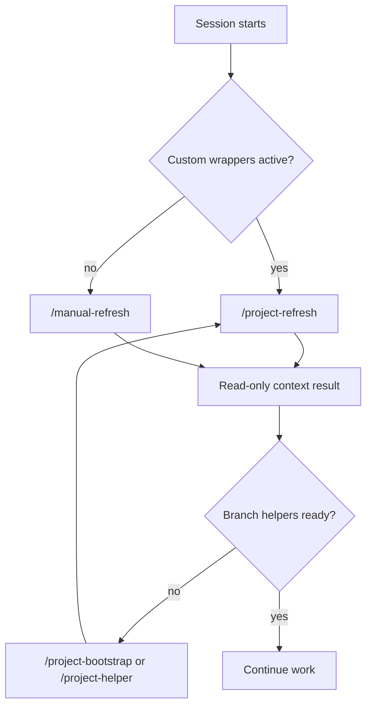
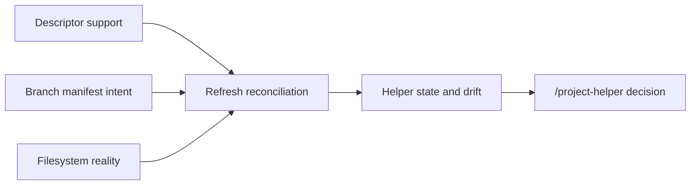
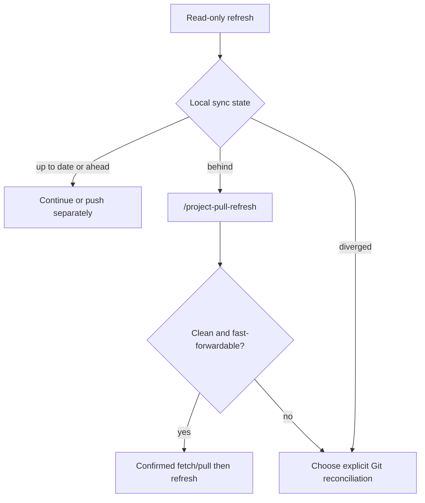
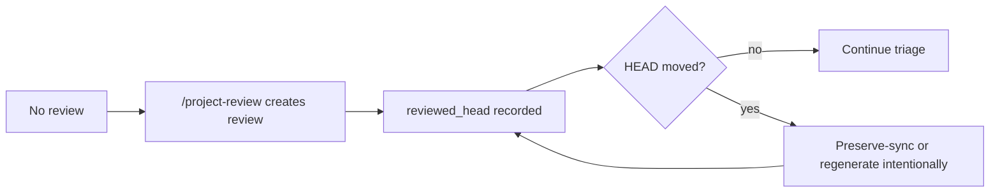

# Branch Context Workflow Maps

## Session entry

## Helper reconciliation

## Shared branch

## Review lifecycle

When a diagram and command behavior differ, the command and [`PATH_CONTRACT.md`](PATH_CONTRACT.md) take precedence and the map should be corrected in the same change.
